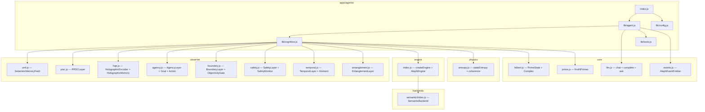

# apps/agentic — Architecture Document

An agentic system that uses **tinyaleph as cognitive middleware** between an LLM and the outside world. TinyAleph's observer layers provide semantic orientation, holographic memory, safety constraints, and attention management — giving the LLM a persistent cognitive substrate rather than a stateless prompt window.

---

## 1. File Structure

```
apps/agentic/
├── index.js              # CLI entry point — REPL + arg parsing
├── lib/
│   ├── config.js          # Configuration defaults + env variable resolution
│   ├── cognitive.js       # CognitiveCore class — wraps all observer layers
│   ├── agent.js           # Agent class — orchestrates CognitiveCore + LLM
│   └── tools.js           # Tool definitions the LLM can invoke
└── README.md              # Usage documentation
```

---

## 2. Module Dependency Graph



---

## 3. Data Flow

```
                        ┌─────────────────────────────────────────────────┐
                        │                   Agent Loop                    │
                        └─────────────────────────────────────────────────┘

 User Input             ┌───────────────┐
─────────────────────>  │ 1. PERCEIVE   │  BoundaryLayer.processInput()
                        │    Sensory    │  EnvironmentalModel.updateContext()
                        └──────┬────────┘
                               │ raw text
                               v
                        ┌───────────────┐
                        │ 2. ENCODE     │  SemanticBackend.encode(text)
                        │    Primes     │  SemanticBackend.textToOrderedState(text)
                        └──────┬────────┘
                               │ primeState, hypercomplex state
                               v
                        ┌───────────────┐
                        │ 3. ORIENT     │  SMF.updateFromPrimeActivity()
                        │    SMF        │  SMF.entropy(), SMF.dominantAxes()
                        └──────┬────────┘
                               │ 16D orientation vector
                               v
                        ┌───────────────┐
                        │ 4. ATTEND     │  AgencyLayer.update(state)
                        │    Agency     │  -> attention foci, goals, actions
                        └──────┬────────┘
                               │ attention context
                               v
                        ┌───────────────┐
                        │ 5. GUARD      │  SafetyLayer.checkConstraints(state)
                        │    Safety     │  SafetyMonitor.update(state)
                        └──────┬────────┘
                               │ safety clearance
                               v
                        ┌───────────────┐
                        │ 6. RECALL     │  HolographicMemory.recall(primeState)
                        │    Memory     │  -> related memories + metadata
                        └──────┬────────┘
                               │ memory context
                               v
                        ┌───────────────┐
                        │ 7. THINK      │  LLM.chat(messages, options)
                        │    LLM Call   │  system prompt = getStateContext()
                        └──────┬────────┘
                               │ LLM response text (may include tool calls)
                               v
                        ┌───────────────┐
                        │ 8. EXECUTE    │  Parse tool calls from LLM response
                        │    Tools      │  Execute tools, feed results back
                        │    (loop)     │  Repeat LLM call if tools were used
                        └──────┬────────┘
                               │ final response text
                               v
                        ┌───────────────┐
                        │ 9. VALIDATE   │  ObjectivityGate.check(output, ctx)
                        │    Gate       │  R(w) >= tau_R ? broadcast : retry
                        └──────┬────────┘
                               │ validated response
                               v
                        ┌───────────────┐
                        │ 10. REMEMBER  │  HolographicMemory.store(state, meta)
                        │     Store     │  TemporalLayer.update(state)
                        └──────┬────────┘
                               │ moment created
                               v
                        ┌───────────────┐
                        │ 11. EVOLVE    │  HolographicEncoder.evolve(state, dt)
                        │     Physics   │  PRSCLayer.step()
                        └──────┬────────┘
                               │
                               v
 Agent Response
<─────────────────────  Return validated response to user
```

---

## 4. Class & Module Interfaces

### 4.1 `lib/config.js`

```js
// Exports a frozen defaults object and a resolve() function

export const DEFAULTS = {
  llm: {
    baseUrl: 'http://192.168.4.79:1234/v1/chat/completions',
    model: 'openai/gpt-oss-20b',
    temperature: 0.7,
    maxTokens: 2048,
  },
  engine: {
    backend: 'semantic',
    dimension: 16,
    primes: [2,3,5,7,11,13,17,19,23,29,31,37,41,43,47,53],
  },
  cognitive: {
    hqeGridSize: 32,         // Smaller grid for speed (default HQE is 64)
    maxMemories: 200,
    memoryDecayRate: 0.005,
    objectivityThreshold: 0.6,
    safetyEnabled: true,
  },
  agent: {
    maxToolRounds: 3,         // Max tool-call loops per turn
    maxConversationHistory: 50,
    systemPromptTemplate: null, // Override system prompt
    verbose: false,
  },
};

/**
 * Resolve config from env vars + user overrides + defaults.
 * Env vars: ALEPH_LLM_URL, ALEPH_LLM_MODEL, ALEPH_TEMPERATURE
 */
export function resolve(userConfig = {}) { /* deep merge */ }
```

### 4.2 `lib/cognitive.js` — `CognitiveCore`

The central class that initializes and coordinates all observer layers.

```js
import { SedenionMemoryField, SMF_AXES } from '../../observer/smf.js';
import { PRSCLayer }                     from '../../observer/prsc.js';
import { HolographicEncoder, HolographicMemory } from '../../observer/hqe.js';
import { AgencyLayer, Goal, Action }     from '../../observer/agency.js';
import { BoundaryLayer, ObjectivityGate } from '../../observer/boundary.js';
import { SafetyLayer }                   from '../../observer/safety.js';
import { TemporalLayer }                 from '../../observer/temporal.js';
import { EntanglementLayer }             from '../../observer/entanglement.js';
import { createEngine }                  from '../../engine/index.js';
import { stateEntropy, coherence }       from '../../physics/entropy.js';

export class CognitiveCore {
  constructor(config) { }

  // ── Lifecycle ──────────────────────────────────────────────
  tick()                         // Evolve physics one step: PRSC.step(), HQE.evolve(), Temporal.update()
  reset()                        // Re-initialize all layers to defaults

  // ── Input Processing ──────────────────────────────────────
  processInput(text)             // text -> { primes, state, coherence, entropy, smfOrientation, dominantAxes }
  //   1. SemanticBackend.encode(text)      -> primes
  //   2. SemanticBackend.textToOrderedState(text) -> hypercomplex state
  //   3. SMF.updateFromPrimeActivity(primeState, prsc.oscillators)
  //   4. Compute coherence & entropy via physics/entropy.js
  //   5. Return structured analysis

  // ── Output Validation ─────────────────────────────────────
  validateOutput(text, context)  // ObjectivityGate.check(text, context) -> { shouldBroadcast, R, reason }

  // ── State Context for LLM ─────────────────────────────────
  getStateContext()              // -> structured string for system prompt injection
  //   Returns a formatted block containing:
  //   - SMF orientation (dominant axes + values)
  //   - Current coherence & entropy
  //   - Active attention foci (from AgencyLayer)
  //   - Active goals (from AgencyLayer)
  //   - Safety alert level
  //   - Recent temporal moments count
  //   - Metacognitive state (confidence, emotional valence)

  // ── Memory ────────────────────────────────────────────────
  remember(input, output, meta)  // Store interaction in HolographicMemory
  //   1. Encode input text to primeState
  //   2. HolographicMemory.store(primeState, { input, output, ...meta, timestamp })

  recall(query, count)           // Retrieve from HolographicMemory
  //   1. Encode query to primeState
  //   2. HolographicMemory.findSimilar(primeState, threshold)
  //   3. Return top-N results with metadata

  // ── Agency ────────────────────────────────────────────────
  updateAgency(state)            // AgencyLayer.update(state) -> { foci, activeGoals }
  createGoal(description, opts)  // AgencyLayer.createExternalGoal(description, opts)

  // ── Accessors ─────────────────────────────────────────────
  get smf()                      // Current SedenionMemoryField instance
  get safetyReport()             // SafetyLayer.generateReport()
  get temporalStats()            // TemporalLayer.getStats()
  get agencyStats()              // AgencyLayer.getStats()
  get memoryCount()              // HolographicMemory.count
}
```

#### Internal State

| Field | Type | Description |
|-------|------|-------------|
| `_smf` | `SedenionMemoryField` | Current 16D semantic orientation |
| `_prsc` | `PRSCLayer` | Prime oscillator bank |
| `_hqe` | `HolographicEncoder` | Holographic projection engine |
| `_memory` | `HolographicMemory` | Holographic content-addressable memory |
| `_agency` | `AgencyLayer` | Attention + goals + actions |
| `_boundary` | `BoundaryLayer` | Self/other boundary with ObjectivityGate |
| `_safety` | `SafetyLayer` | Hard/soft constraint enforcement |
| `_temporal` | `TemporalLayer` | Emergent time from coherence events |
| `_entanglement` | `EntanglementLayer` | Semantic binding between concepts |
| `_engine` | `AlephEngine` | Unified encode-excite-evolve-sample-decode pipeline |
| `_backend` | `SemanticBackend` | Text encoding to primes (via engine) |
| `_tickCount` | `number` | Internal tick counter |

### 4.3 `lib/agent.js` — `Agent`

Orchestrates the `CognitiveCore` with the LLM in a conversation loop.

```js
import LLM from '../../core/llm.js';
import { AlephEventEmitter } from '../../core/events.js';
import { CognitiveCore } from './cognitive.js';
import { TOOL_DEFINITIONS, executeTool } from './tools.js';
import { resolve } from './config.js';

export class Agent extends AlephEventEmitter {
  constructor(config) { }

  // ── Core Loop ─────────────────────────────────────────────
  async turn(userMessage)       // Single conversation turn (see Algorithm §5)
  //   Returns { response, stateContext, toolResults, gateResult, moment }

  // ── REPL ──────────────────────────────────────────────────
  async repl()                   // Interactive readline loop
  //   - Reads user input from stdin
  //   - Calls turn(input)
  //   - Prints response
  //   - Handles /commands: /state, /memory, /goals, /safety, /reset, /quit

  // ── Conversation Management ───────────────────────────────
  get history()                  // Array of { role, content } messages
  clearHistory()                 // Reset conversation but keep cognitive state
  fullReset()                    // Reset both conversation and cognitive state

  // ── System Prompt Construction ────────────────────────────
  buildSystemPrompt()            // Compose base prompt + CognitiveCore.getStateContext()
  //   Template:
  //   "You are an AI agent with cognitive middleware providing semantic awareness.
  //    Your current cognitive state:
  //    {stateContext}
  //    Available tools: {toolDescriptions}
  //    ..."

  // ── Tool Handling ─────────────────────────────────────────
  parseToolCalls(llmResponse)    // Extract tool invocations from LLM output
  async executeTools(toolCalls)  // Run tools, return results array

  // ── Events Emitted ────────────────────────────────────────
  // 'turn:start'     { userMessage }
  // 'turn:encoded'   { primes, coherence, entropy, smfOrientation }
  // 'turn:llm'       { messages, response }
  // 'turn:tools'     { toolCalls, results }
  // 'turn:validated' { gateResult }
  // 'turn:complete'  { response, moment }
  // 'safety:alert'   { violation }
  // 'error'          { error }
}
```

#### Internal State

| Field | Type | Description |
|-------|------|-------------|
| `_core` | `CognitiveCore` | Cognitive middleware instance |
| `_config` | `object` | Resolved configuration |
| `_messages` | `Array` | Conversation history `[{role, content}]` |
| `_turnCount` | `number` | Total turns processed |

### 4.4 `lib/tools.js`

Tool definitions for the LLM to invoke. Uses a JSON schema format compatible with OpenAI function calling.

```js
export const TOOL_DEFINITIONS = [
  {
    name: 'read_file',
    description: 'Read the contents of a file at the given path',
    parameters: {
      type: 'object',
      properties: {
        path: { type: 'string', description: 'File path to read' }
      },
      required: ['path']
    }
  },
  {
    name: 'write_file',
    description: 'Write content to a file at the given path',
    parameters: {
      type: 'object',
      properties: {
        path: { type: 'string', description: 'File path to write' },
        content: { type: 'string', description: 'Content to write' }
      },
      required: ['path', 'content']
    }
  },
  {
    name: 'list_files',
    description: 'List files and directories at the given path',
    parameters: {
      type: 'object',
      properties: {
        path: { type: 'string', description: 'Directory path to list' }
      },
      required: ['path']
    }
  },
  {
    name: 'run_command',
    description: 'Execute a shell command and return its output',
    parameters: {
      type: 'object',
      properties: {
        command: { type: 'string', description: 'Shell command to execute' }
      },
      required: ['command']
    }
  },
  {
    name: 'web_search',
    description: 'Search the web for information (stub — returns placeholder)',
    parameters: {
      type: 'object',
      properties: {
        query: { type: 'string', description: 'Search query' }
      },
      required: ['query']
    }
  },
  {
    name: 'recall_memory',
    description: 'Search holographic memory for semantically similar past interactions',
    parameters: {
      type: 'object',
      properties: {
        query: { type: 'string', description: 'Memory search query' }
      },
      required: ['query']
    }
  }
];

/**
 * Execute a tool by name with given arguments.
 * Returns { success: boolean, result: string, error?: string }
 */
export async function executeTool(name, args, context) { }
```

### 4.5 `index.js` — Entry Point

```js
#!/usr/bin/env node
import { Agent } from './lib/agent.js';
import { resolve } from './lib/config.js';

// Parse CLI args for --model, --url, --verbose, --temperature
const config = resolve(parsedArgs);

const agent = new Agent(config);
await agent.repl();
```

---

## 5. The Agent Loop Algorithm

Each call to [`Agent.turn()`](apps/agentic/lib/agent.js) executes the following steps:

### Step 1 — PERCEIVE

```
BoundaryLayer.processInput('text_input', userMessage)
  -> Updates sensory channel
  -> Updates EnvironmentalModel context
  -> Returns { channel, result, primes }
```

The boundary layer registers the input as coming from an external source and updates the environmental model.

### Step 2 — ENCODE

```
SemanticBackend.encode(userMessage)            -> primes[]
SemanticBackend.textToOrderedState(userMessage) -> Hypercomplex state (16D)
```

The text is tokenized, mapped to primes via vocabulary + hash fallback, then composed into a non-commutative hypercomplex state that preserves word order.

### Step 3 — ORIENT

```
SMF.updateFromPrimeActivity(primeState, prsc.oscillators, { couplingRate: 0.1 })
smfOrientation = SMF.toObject()     // { coherence: 0.82, identity: 0.31, ... }
dominantAxes   = SMF.dominantAxes(3) // top-3 semantic axes
smfEntropy     = SMF.entropy()
```

The 16D semantic orientation updates based on the input's prime signature. This captures the semantic *character* of the input across axes like coherence, identity, duality, harmony, wisdom, consciousness, etc.

### Step 4 — ATTEND

```
AgencyLayer.update({
  prsc, smf, coherence, entropy, activePrimes, semanticContent
})
  -> Updates attention baselines for novelty detection
  -> Allocates/decays attention foci
  -> Checks goal-generating conditions from SMF imbalances
  -> Updates metacognitive state (load, valence, confidence)
  -> Returns { foci, activeGoals, processingLoad }
```

The agency layer determines what the system is paying attention to (novel primes, shifted SMF axes), creates corrective goals when axes drift out of desired ranges, and tracks metacognitive state.

### Step 5 — GUARD

```
SafetyLayer.checkConstraints({
  coherence, entropy, totalAmplitude, smf, processingLoad
})
  -> Checks hard constraints (coherence_minimum, amplitude_maximum, smf_bounds)
  -> Checks soft constraints (entropy_balance, processing_load)
  -> Checks ethical constraints (honesty, harm_prevention)
  -> SafetyMonitor detects runaway dynamics, coherence crashes
  -> Returns { safe, violations, alertLevel, issues }
```

If `safe === false` due to a blocking constraint, the agent loop halts and returns an error message rather than calling the LLM.

### Step 6 — RECALL

```
CognitiveCore.recall(userMessage, 3)
  -> Encodes query to primeState
  -> HolographicMemory.findSimilar(primeState, threshold=0.3)
  -> Returns top-3 matching memories with metadata
```

Retrieved memories are injected into the LLM context as additional grounding.

### Step 7 — THINK

```
systemPrompt = Agent.buildSystemPrompt()
  = BASE_SYSTEM_PROMPT
  + CognitiveCore.getStateContext()
  + TOOL_DESCRIPTIONS
  + MEMORY_CONTEXT (from step 6)

messages = [
  { role: 'system',    content: systemPrompt },
  ...conversationHistory,
  { role: 'user',      content: userMessage }
]

llmResult = await LLM.chat(messages, { temperature, maxTokens })
```

The LLM receives a system prompt enriched with the cognitive state context — current SMF orientation, attention foci, active goals, safety status, and retrieved memories. This gives the LLM awareness of its own cognitive state without it being "in" the state.

### Step 8 — EXECUTE (Tool Loop)

```
toolCalls = Agent.parseToolCalls(llmResult.content)

round = 0
while toolCalls.length > 0 AND round < maxToolRounds:
  results = await Agent.executeTools(toolCalls)
  messages.push({ role: 'assistant', content: llmResult.content })
  messages.push({ role: 'user', content: formatToolResults(results) })
  llmResult = await LLM.chat(messages, options)
  toolCalls = Agent.parseToolCalls(llmResult.content)
  round++
```

The LLM can request tool calls using a structured format. The agent executes tools and feeds results back, allowing multi-step reasoning with real-world I/O.

### Step 9 — VALIDATE

```
gateResult = CognitiveCore.validateOutput(llmResult.content, {
  input: userMessage,
  smf: currentSMF,
  goals: activeGoals
})

if (!gateResult.shouldBroadcast):
  // Output failed ObjectivityGate
  // Option A: Retry with modified prompt (up to 1 retry)
  // Option B: Return with warning annotation
```

The ObjectivityGate (Section 7, equation 18) runs the output through multiple decoders:
- **coherence** — internal consistency check
- **relevance** — word overlap with input
- **completeness** — complete thought check
- **safety** — harmful content patterns
- **identity** — consistent identity claims

`R(w) = (1/K) * sum(1{decoder_k agrees})` must exceed threshold `tau_R`.

### Step 10 — REMEMBER

```
CognitiveCore.remember(userMessage, llmResult.content, {
  coherence, entropy, smfOrientation, turnNumber
})

TemporalLayer.update({ coherence, entropy, activePrimes, smf })
  -> May create a new Moment if coherence peaks or phase transitions occur
```

The interaction is stored holographically for future recall. The temporal layer may register a new discrete moment of experience.

### Step 11 — EVOLVE

```
CognitiveCore.tick()
  -> PRSCLayer.step()                          // Evolve Kuramoto oscillators
  -> HolographicEncoder.evolve(state, dt)      // Damped field evolution
  -> TemporalLayer.update(state)               // Check for moment triggers
  -> EntanglementLayer.update(state)           // Update semantic bindings
  -> SelfModel.updateSelfOrientation(smf)      // Refine identity model
```

The physics evolve one step, allowing the oscillator bank to settle toward coherence, the holographic field to stabilize, and the temporal layer to register experiential time.

---

## 6. TinyAleph Component → Agentic Capability Mapping

| TinyAleph Component | Agentic Capability | Role in Agent Loop |
|---|---|---|
| `SemanticBackend` | Input understanding | Step 2: text → prime encoding |
| `SedenionMemoryField` | Semantic orientation | Step 3: 16D identity/coherence tracking |
| `PRSCLayer` | Oscillator dynamics | Steps 3,11: prime resonance + coherence computation |
| `HolographicMemory` | Long-term memory | Steps 6,10: content-addressable recall + storage |
| `HolographicEncoder` | Memory projection | Step 10: distributed holographic storage via DFT |
| `AgencyLayer` | Attention + Goals | Step 4: novelty detection, goal formation, metacognition |
| `BoundaryLayer` | I/O boundary | Step 1: input classification, channel management |
| `ObjectivityGate` | Output validation | Step 9: multi-decoder redundancy check R >= tau_R |
| `SafetyLayer` | Constraint enforcement | Step 5: hard/soft constraints, ethical guards |
| `SafetyMonitor` | Runaway detection | Step 5: amplitude/coherence/entropy trend monitoring |
| `TemporalLayer` | Experiential time | Step 10: moments from coherence events |
| `EntanglementLayer` | Concept binding | Step 11: semantic links between concepts |
| `SelfModel` | Identity continuity | Step 11: persistent self-orientation in SMF space |
| `AlephEngine` | Physics pipeline | Step 2: encode-excite-evolve-sample-decode |
| `LLM` | Language generation | Step 7: response generation with state-enriched prompt |
| `AlephEventEmitter` | Event system | All steps: async event emission for monitoring |

---

## 7. `getStateContext()` Output Format

The state context injected into the LLM system prompt is a structured text block:

```
═══ COGNITIVE STATE ═══

ORIENTATION (SMF):
  dominant: coherence=0.82, wisdom=0.45, consciousness=0.38
  entropy: 0.34 (focused)
  codebook: nearest attractor #3 [coherence, structure], distance=0.12

PHYSICS:
  coherence: 0.78
  entropy: 0.31
  lambda: 0.12 (normal stabilization)

ATTENTION:
  focus[0]: prime 7 (intensity=0.8, novelty=0.6)
  focus[1]: concept 'harmony' (intensity=0.5, novelty=0.3)

GOALS:
  [active] Restore coherence (priority=0.7, progress=0.4)
  [active] Explore user query (priority=0.9, progress=0.1)

METACOGNITION:
  confidence: 0.72
  processing_load: 0.35
  emotional_valence: 0.15

SAFETY:
  alert_level: normal
  constraints: 8 active (3 hard, 3 soft, 2 monitoring)

MEMORY:
  stored: 42 memories
  recent_moments: 7

═══════════════════════
```

This gives the LLM awareness of its own cognitive substrate without coupling it to internal data structures.

---

## 8. Configuration Reference

### Environment Variables

| Variable | Maps to | Default |
|---|---|---|
| `ALEPH_LLM_URL` | `config.llm.baseUrl` | `http://192.168.4.79:1234/v1/chat/completions` |
| `ALEPH_LLM_MODEL` | `config.llm.model` | `openai/gpt-oss-20b` |
| `ALEPH_TEMPERATURE` | `config.llm.temperature` | `0.7` |
| `ALEPH_MAX_TOKENS` | `config.llm.maxTokens` | `2048` |
| `ALEPH_VERBOSE` | `config.agent.verbose` | `false` |

### Constructor Options

```js
new Agent({
  llm: {
    baseUrl: 'http://localhost:1234/v1/chat/completions',
    model: 'local-model',
    temperature: 0.7,
    maxTokens: 2048,
  },
  engine: {
    backend: 'semantic',    // 'semantic' | 'scientific' | 'cryptographic'
    dimension: 16,
    primes: [2,3,5,7,11,13,17,19,23,29,31,37,41,43,47,53],
  },
  cognitive: {
    hqeGridSize: 32,
    maxMemories: 200,
    memoryDecayRate: 0.005,
    objectivityThreshold: 0.6,
    safetyEnabled: true,
  },
  agent: {
    maxToolRounds: 3,
    maxConversationHistory: 50,
    systemPromptTemplate: null,
    verbose: false,
  },
})
```

---

## 9. REPL Commands

The interactive REPL supports slash commands:

| Command | Description |
|---|---|
| `/state` | Print full cognitive state (SMF, coherence, entropy, lambda) |
| `/memory` | List stored memories with timestamps |
| `/goals` | Show active goals and their progress |
| `/safety` | Print safety report (constraints, violations, alert level) |
| `/attention` | Show current attention foci |
| `/temporal` | Show temporal stats and recent moments |
| `/reset` | Reset cognitive state (keep conversation) |
| `/clear` | Clear conversation history (keep cognitive state) |
| `/full-reset` | Reset everything |
| `/config` | Show current configuration |
| `/quit` | Exit |

---

## 10. Tool Call Protocol

The agent uses a simple text-based tool protocol in the LLM output. The LLM is instructed to emit tool calls in this format:

```
<tool_call>
{"name": "read_file", "args": {"path": "package.json"}}
</tool_call>
```

The agent parses these, executes the tool, and returns results as:

```
<tool_result name="read_file">
{"success": true, "result": "{ ... file contents ... }"}
</tool_result>
```

This continues in a loop until the LLM produces a response without tool calls, or the maximum tool rounds are exhausted.

---

## 11. Import Paths

All imports use relative ESM paths from the `apps/agentic/` directory:

| Target | Import Path |
|---|---|
| `SedenionMemoryField`, `SMF_AXES` | `../../observer/smf.js` |
| `PRSCLayer` | `../../observer/prsc.js` |
| `HolographicEncoder`, `HolographicMemory` | `../../observer/hqe.js` |
| `AgencyLayer`, `Goal`, `Action` | `../../observer/agency.js` |
| `BoundaryLayer`, `ObjectivityGate` | `../../observer/boundary.js` |
| `SafetyLayer`, `SafetyMonitor` | `../../observer/safety.js` |
| `TemporalLayer`, `Moment` | `../../observer/temporal.js` |
| `EntanglementLayer` | `../../observer/entanglement.js` |
| `LLM` | `../../core/llm.js` |
| `PrimeState`, `Complex` | `../../core/hilbert.js` |
| `firstNPrimes` | `../../core/prime.js` |
| `AlephEventEmitter` | `../../core/events.js` |
| `createEngine` | `../../engine/index.js` |
| `stateEntropy`, `coherence` | `../../physics/entropy.js` |

---

## 12. Design Invariants

1. **No global state.** All mutable state lives inside `CognitiveCore` and `Agent` instances. The `LLM` module uses module-level state via `configure()`, called once at Agent construction.

2. **ESM only.** All files use `import`/`export`. No `require()`.

3. **Safety cannot be bypassed.** The `SafetyLayer` is checked *before* the LLM call (step 5) and the `ObjectivityGate` is checked *after* (step 9). Both must pass for output to reach the user.

4. **Holographic memory is content-addressable.** Recall uses prime-space correlation, not keyword matching. Semantically similar content is retrieved regardless of surface form.

5. **The SMF orientation persists across turns.** It provides continuity of "cognitive character" — the agent's evolving semantic disposition. This is the identity mechanism.

6. **The LLM is stateless; the CognitiveCore is stateful.** The LLM receives cognitive state as prompt context. It does not modify the cognitive state directly — only the agent loop does, based on input/output analysis.

7. **Physics evolve every turn.** The `tick()` at the end of each turn allows oscillators to settle, holographic fields to stabilize, and temporal moments to emerge from coherence dynamics.
