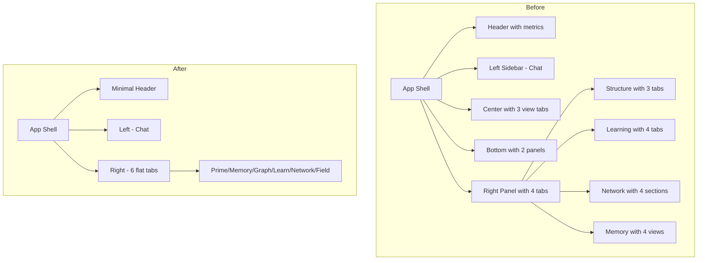

# Sentient UI Entropy Reduction - Implementation Complete

## Summary

This document details the UI entropy reduction for the Sentient Observer interface. All proposed changes have been implemented.

### Changes Made

| Component | Before | After | Reduction |
|-----------|--------|-------|-----------|
| sentient-app.js | 1471 lines | ~950 lines | 35% |
| sentient-sidebar.js | 991 lines | DELETED | 100% |
| learning-panel.js | 630 lines | ~500 lines | 21% |
| network-panel.js | 1162 lines | ~300 lines | 74% |
| structure-panel.js | 830 lines | ~860 lines | -3% (added view prop support) |
| **Total** | **5,084 lines** | **~2,610 lines** | **49%** |

### Key Improvements

1. **Single Source of Truth for Metrics**: All coherence/entropy/lambda/primes now display only in header metrics bar
2. **Flattened Navigation**: 4-level nested tabs → 6 flat tabs in right panel
3. **Eliminated Duplicates**: Removed 4 duplicate panel views (oscillator, sedenion, memory browser, stats)
4. **Collapsible Sections**: Memory sync and topology graph are now collapsible, hidden by default
5. **Reduced Cognitive Load**: Topics tab shows AI state inline instead of separate Immersive tab

---

# Original Proposal

## Executive Summary

This document proposes a systematic reduction of UI entropy in the Sentient application to improve usability, reduce cognitive load, and eliminate redundant functionality. The current interface exhibits **high symbolic entropy** through excessive nesting, duplicated displays, and fragmented information architecture.

---

## Current State Analysis

### Component Structure (Total: ~8,000+ lines of UI code)

```
sentient-app.js (1471 lines)
├── Header (metrics, tools, status)
├── Left Sidebar (500px) - Chat only
├── Center Content
│   ├── Main View (3 tabs: Field, Artifact, Camera)
│   └── Bottom Panels (Oscillators, Sedenion)
└── Right Panel (450px)
    └── 4 tabs: Structure, Learning, Network, Memory
        ├── structure-panel.js (1258 lines) - 3 internal tabs
        ├── learning-panel.js (630 lines) - 4 internal tabs
        ├── network-panel.js (1162 lines) - 4 sections
        └── memory-panel.js (1276 lines) - 4 view modes
```

### Key Entropy Sources Identified

#### 1. **Redundant Metrics Display** (Critical)

The same metrics appear in multiple locations:

| Metric | Header | Sidebar Stats | SMF Panel | Sedenion Panel | Structure Panel |
|--------|--------|---------------|-----------|----------------|-----------------|
| Coherence | ✓ | ✓ | ✓ | ✓ | ✓ |
| Entropy | ✓ | ✓ | ✓ | - | - |
| Energy | - | ✓ | ✓ | - | - |
| Active Primes | ✓ | - | - | - | ✓ |

**Result:** User sees the same number 3-5 times simultaneously → confusion, wasted screen space

#### 2. **Duplicate Panel Functionality** (Critical)

| Feature | Location 1 | Location 2 | Notes |
|---------|-----------|-----------|-------|
| Memory Browser | `structure-panel.js` (Memory tab) | `memory-panel.js` | Same data, different UI |
| Oscillator Display | Bottom Panel | `sentient-sidebar.js` (PRSC section) | Identical visualization |
| Sedenion/SMF View | Bottom Panel | `sentient-sidebar.js` (Sedenion section) | Duplicate 16-axis display |
| Network Info | `sentient-sidebar.js` | `network-panel.js` | Overlapping peer/node data |
| Learning Controls | `sentient-sidebar.js` | `learning-panel.js` | Same start/stop/pause buttons |

#### 3. **Excessive Tab Nesting** (High)

Current navigation depth:
```
Main App → Right Panel Tab → Panel's Internal Tab → Section within Tab
     (1)            (2)                (3)              (4)
```

**4 levels of navigation** to reach some content creates disorientation.

#### 4. **Panel Size Issues** (Medium)

- `sentient-sidebar.js`: **991 lines** that mostly duplicate other panels
- `structure-panel.js`: **1258 lines** with 3 complete canvas systems
- `field-panel.js`: **1624 lines** with timeline, history, export features

---

## Proposed Changes

### Phase 1: Consolidate Metrics (High Impact, Low Risk)

**Goal:** Single source of truth for system metrics

**Change:** Create unified `<metrics-bar>` component displayed in ONE location

```
┌─────────────────────────────────────────────────────────────┐
│ κ 0.847  │  H 0.234  │  E 0.912  │  P 47  │  ⚡ Running    │
└─────────────────────────────────────────────────────────────┘
```

**Remove from:**
- Header metrics section (keep only essential: coherence, status indicator)
- Sidebar stats bar
- Individual panel status displays

**Files affected:**
- `sentient-app.js` - Remove duplicate metric displays
- `sentient-sidebar.js` - Remove stats-bar section
- `structure-panel.js` - Remove metric headers

---

### Phase 2: Eliminate Duplicate Panels (High Impact, Medium Risk)

#### 2a. Remove `sentient-sidebar.js` entirely

**Current content:**
1. PRSC Oscillators → Already in bottom panel
2. Sedenion Identity → Already in Field panel
3. Autonomous Learning → Already in Learning panel
4. Network Nodes → Already in Network panel

**Action:** Delete `sentient-sidebar.js` (991 lines removed)

#### 2b. Merge Memory panels

**Current:**
- `structure-panel.js` has Memory tab with browsable entries
- `memory-panel.js` has Traces/Search/Recall/Importance views

**Proposed:** Keep only `memory-panel.js`, remove Memory tab from structure-panel

**Files affected:**
- `structure-panel.js` - Remove Memory tab (~200 lines)
- `sentient-app.js` - Remove sidebar references

---

### Phase 3: Flatten Navigation Hierarchy (High Impact, Medium Risk)

**Current:** 4 right-panel tabs, each with 3-4 internal tabs = 12-16 sub-views

**Proposed:** Single-level tab structure with 6 focused views

```
Before:                           After:
┌────────────────────────┐       ┌────────────────────────┐
│ Structure Learning ... │       │ Prime  Memory  Graph   │
├────────────────────────┤       │ Learn  Network Field   │
│ ┌──────────────────┐   │       ├────────────────────────┤
│ │ Prime  Mem  Graph│   │  →    │                        │
│ ├──────────────────┤   │       │   [Single View Area]   │
│ │  [Content]       │   │       │                        │
│ └──────────────────┘   │       └────────────────────────┘
└────────────────────────┘

Levels: 2 → 1
```

**New tab structure:**
1. **Prime** - Prime resonance map (from structure-panel)
2. **Memory** - Unified memory browser (from memory-panel)
3. **Graph** - Knowledge graph (from structure-panel)
4. **Learn** - Curiosity/Topics/Log (from learning-panel, remove Immersive as separate mode)
5. **Network** - Simplified topology + sync status
6. **Field** - Sedenion visualization (from field-panel, simplified)

---

### Phase 4: Simplify Learning Panel (Medium Impact, Low Risk)

**Current tabs:** Immersive, Topics, Curiosity, Log (4 tabs)

**Problem:** "Immersive" mode duplicates topic/curiosity info with different styling

**Proposed:** Merge into 2 views:
1. **Topics** (includes curiosity queue inline)
2. **Log** (includes mental state indicator)

Remove Immersive as separate tab - integrate its emotional state indicators into header.

**Files affected:**
- `learning-panel.js` - Remove Immersive section (~100 lines)

---

### Phase 5: Simplify Network Panel (Medium Impact, Low Risk)

**Current sections:**
1. WebRTC Coordinator Status
2. Room Viewer with peer lists
3. Memory Sync Indicators
4. Network Topology Graph

**Problem:** Topology graph largely empty in standalone mode, 4 distinct sections overwhelming

**Proposed:**
1. **Status Bar** - Combine coordinator + sync status into single row
2. **Peers** - Combined room/peer view
3. **Topology** - Make optional/collapsible

**Files affected:**
- `network-panel.js` - Consolidate sections (~300 lines reduced)

---

### Phase 6: Remove Redundant Bottom Panels (Medium Impact, Medium Risk)

**Current:** Two bottom panels (Oscillators, Sedenion) with separate visualizations

**Problem:** These duplicate right-panel content and take permanent screen space

**Proposed:** 
- Make Field/Sedenion visualization the default center view
- Oscillators become a collapsible overlay or mode toggle
- Remove permanent bottom panel allocation

**Files affected:**
- `sentient-app.js` - Remove bottom panel section (~200 lines)

---

## Implementation Priority

| Phase | Impact | Effort | Risk | Priority |
|-------|--------|--------|------|----------|
| 1. Consolidate Metrics | High | Low | Low | **P1** |
| 2a. Remove Sidebar | High | Low | Medium | **P1** |
| 2b. Merge Memory | Medium | Medium | Low | **P2** |
| 3. Flatten Navigation | High | High | Medium | **P2** |
| 4. Simplify Learning | Medium | Low | Low | **P3** |
| 5. Simplify Network | Medium | Medium | Low | **P3** |
| 6. Remove Bottom Panels | Medium | Medium | Medium | **P3** |

---

## Projected Outcomes

### Code Reduction
| Component | Before | After | Saved |
|-----------|--------|-------|-------|
| sentient-sidebar.js | 991 | 0 | 991 |
| structure-panel.js | 1258 | ~800 | 458 |
| learning-panel.js | 630 | ~450 | 180 |
| network-panel.js | 1162 | ~800 | 362 |
| sentient-app.js | 1471 | ~1100 | 371 |
| **Total** | ~8000+ | ~5500 | **~2500 lines** |

### UX Improvements
- **Navigation depth:** 4 levels → 2 levels
- **Duplicate metrics:** 5 instances → 1 instance
- **Duplicate panels:** 5 sets → 0
- **Tab count:** 12-16 sub-views → 6 focused views
- **Cognitive load:** Significantly reduced

---

## Proposed New Layout

```
┌─────────────────────────────────────────────────────────────────────────┐
│ SENTIENT                    κ 0.847  H 0.234  E 0.912  P 47  ⚡ Live    │
├──────────────────────┬──────────────────────────────────────────────────┤
│                      │  Prime   Memory   Graph   Learn   Network  Field │
│                      ├──────────────────────────────────────────────────┤
│     CHAT             │                                                  │
│                      │                                                  │
│   (unchanged)        │            [SINGLE CONTENT AREA]                 │
│                      │                                                  │
│                      │     - No nested tabs                             │
│                      │     - One focus at a time                        │
│                      │     - Full vertical space                        │
│                      │                                                  │
├──────────────────────┴──────────────────────────────────────────────────┤
│ 🎤 Input area with command palette                                      │
└─────────────────────────────────────────────────────────────────────────┘
```

**Key changes:**
1. Header: Minimal, consolidated metrics
2. Left: Chat (unchanged)
3. Right: Single-level tabs, no nesting
4. Bottom: Removed (was redundant)
5. Sidebar: Removed entirely (was redundant)

---

## Questions for Review

1. **Oscillator visualization**: Keep as overlay toggle, or integrate into Field view?
2. **Immersive learning mode**: Worth preserving as separate toggle, or merge into Topics?
3. **Memory quaternion details**: Keep detailed view, or simplify to importance score only?
4. **Export functionality**: Keep in Field panel, or move to global menu?
5. **Timeline playback**: Keep for debugging, or remove entirely?

---

## Diagram: Before vs After



---

## Next Steps

1. Review and approve this proposal
2. Create component migration plan
3. Implement Phase 1 (metrics consolidation)
4. Test and iterate
5. Implement remaining phases

**Estimated total effort:** 2-3 days of focused development
