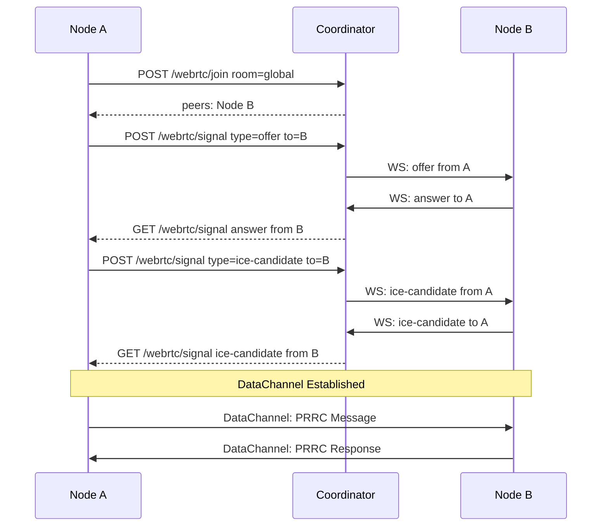
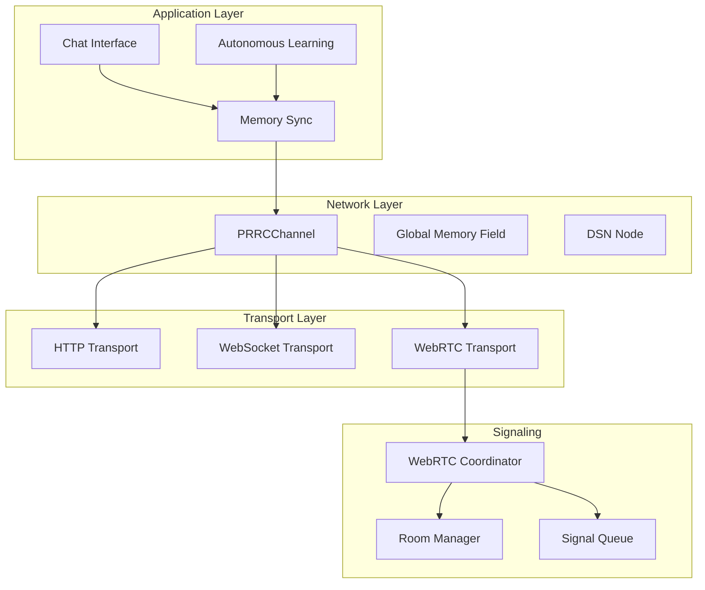

# WebRTC Coordinator Design for Sentient Observer

## Overview

This design adds WebRTC coordination capabilities to the Sentient Observer when running in `--server` mode. The coordinator enables peer-to-peer connections between nodes for real-time data channel communication, complementing the existing HTTP-based seed synchronization.

## Architecture

```
                                    ┌─────────────────────────────────────┐
                                    │        SEED/COORDINATOR NODE        │
                                    │         (--server mode)             │
                                    │                                     │
                                    │  ┌────────────────────────────────┐ │
                                    │  │    WebRTC Coordinator          │ │
                                    │  │    /webrtc/*                   │ │
                                    │  │                                │ │
                                    │  │  - Room Management             │ │
                                    │  │  - ICE Candidate Relay         │ │
                                    │  │  - SDP Exchange                │ │
                                    │  │  - Peer Registry               │ │
                                    │  └────────────────────────────────┘ │
                                    │                                     │
                                    │  ┌────────────────────────────────┐ │
                                    │  │    Existing Services           │ │
                                    │  │    /nodes, /memory, /chat      │ │
                                    │  └────────────────────────────────┘ │
                                    └──────────────┬──────────────────────┘
                                                   │
                    ┌──────────────────────────────┼──────────────────────────────┐
                    │                              │                              │
            ┌───────▼───────┐              ┌───────▼───────┐              ┌───────▼───────┐
            │   CLI Node    │              │  Server Node  │              │ Browser Node  │
            │               │◄────────────►│               │◄────────────►│               │
            │  WebRTC Peer  │   DataChannel│  WebRTC Peer  │  DataChannel │  WebRTC Peer  │
            └───────────────┘              └───────────────┘              └───────────────┘
```

## Key Design Principles

### 1. Coordinator Discovery via Seed
When a node connects to a seed, the seed's `/nodes` endpoint now includes WebRTC coordinator info:

```json
{
  "nodeId": "seed-node-abc",
  "networkId": "sentient-network-001",
  "webrtc": {
    "enabled": true,
    "coordinatorUrl": "http://192.168.1.100:8888/webrtc",
    "stunServers": ["stun:stun.l.google.com:19302"],
    "turnServers": []
  },
  "seeds": [],
  "uptime": 3600
}
```

### 2. Room-Based Topology
Peers join "rooms" based on purpose:
- **global**: All nodes in the network - for broadcast announcements
- **memory-sync**: Nodes interested in memory synchronization
- **learning**: Nodes sharing autonomous learning insights
- **custom**: Application-defined rooms

### 3. Signaling Protocol

#### WebSocket Connection (preferred for real-time)
```
ws://coordinator:port/webrtc/signal?nodeId=abc&room=global
```

#### HTTP Polling Fallback
```
POST /webrtc/signal     - Send signal
GET  /webrtc/signal     - Poll for signals (long-polling)
```

### 4. Federation
Coordinators can federate to bridge separate networks:

```
┌──────────────┐         ┌──────────────┐
│ Coordinator A│◄───────►│ Coordinator B│
│   Room: X    │ Bridge  │   Room: X    │
└──────────────┘         └──────────────┘
       ▲                        ▲
       │                        │
   ┌───┴───┐                ┌───┴───┐
   │Node 1 │                │Node 2 │
   └───────┘                └───────┘
```

## API Design

### Coordinator Endpoints (Server Mode Only)

#### `GET /webrtc/info`
Get coordinator information and capabilities.

**Response:**
```json
{
  "enabled": true,
  "nodeId": "coordinator-xyz",
  "rooms": ["global", "memory-sync", "learning"],
  "peerCount": 5,
  "stunServers": ["stun:stun.l.google.com:19302"],
  "turnServers": [],
  "websocketUrl": "ws://192.168.1.100:8888/webrtc/signal",
  "httpFallback": true
}
```

#### `POST /webrtc/join`
Join a room and get current peer list.

**Request:**
```json
{
  "nodeId": "client-abc",
  "room": "global",
  "metadata": {
    "name": "Observer-1",
    "capabilities": ["memory-sync", "learning"]
  }
}
```

**Response:**
```json
{
  "success": true,
  "room": "global",
  "peers": [
    { "nodeId": "peer-1", "name": "Observer-2", "joinedAt": 1703520000000 },
    { "nodeId": "peer-2", "name": "Observer-3", "joinedAt": 1703520100000 }
  ],
  "iceServers": [
    { "urls": "stun:stun.l.google.com:19302" }
  ]
}
```

#### `POST /webrtc/signal`
Exchange SDP offers/answers and ICE candidates.

**Request:**
```json
{
  "from": "client-abc",
  "to": "peer-1",
  "room": "global",
  "type": "offer",
  "payload": {
    "sdp": "v=0\r\no=- 4611731400430051336..."
  }
}
```

**Response:**
```json
{
  "success": true,
  "queued": true
}
```

#### `GET /webrtc/signal?nodeId=xxx&room=yyy`
Long-poll for incoming signals.

**Response:**
```json
{
  "signals": [
    {
      "from": "peer-1",
      "type": "answer",
      "payload": { "sdp": "..." },
      "timestamp": 1703520200000
    }
  ]
}
```

#### `POST /webrtc/leave`
Leave a room.

**Request:**
```json
{
  "nodeId": "client-abc",
  "room": "global"
}
```

#### `GET /webrtc/peers?room=xxx`
List peers in a room.

**Response:**
```json
{
  "room": "global",
  "peers": [
    {
      "nodeId": "peer-1",
      "name": "Observer-2",
      "online": true,
      "lastSeen": 1703520300000,
      "metadata": {}
    }
  ]
}
```

### WebSocket Protocol (Real-time Signaling)

Connection: `ws://host:port/webrtc/signal`

#### Client → Server Messages:

```json
{ "type": "join", "room": "global", "nodeId": "abc", "metadata": {} }
{ "type": "leave", "room": "global", "nodeId": "abc" }
{ "type": "offer", "to": "peer-1", "room": "global", "sdp": "..." }
{ "type": "answer", "to": "peer-1", "room": "global", "sdp": "..." }
{ "type": "ice-candidate", "to": "peer-1", "room": "global", "candidate": {} }
{ "type": "ping" }
```

#### Server → Client Messages:

```json
{ "type": "peer-joined", "room": "global", "peer": { "nodeId": "xyz", "metadata": {} } }
{ "type": "peer-left", "room": "global", "peerId": "xyz" }
{ "type": "offer", "from": "peer-1", "room": "global", "sdp": "..." }
{ "type": "answer", "from": "peer-1", "room": "global", "sdp": "..." }
{ "type": "ice-candidate", "from": "peer-1", "room": "global", "candidate": {} }
{ "type": "error", "message": "..." }
{ "type": "pong" }
```

## Module Structure

```
apps/sentient/lib/
├── webrtc/
│   ├── index.js              # Main exports
│   ├── coordinator.js        # WebRTC coordinator for server mode
│   ├── peer.js               # WebRTC peer client for all modes
│   ├── room.js               # Room management
│   ├── signaling.js          # Signaling protocol handling
│   └── transport.js          # DataChannel transport for PRRCChannel
```

## File Descriptions

### `coordinator.js` - WebRTC Coordinator

```javascript
class WebRTCCoordinator {
    constructor(options) {
        this.rooms = new Map();           // room -> Set<peerId>
        this.peers = new Map();           // peerId -> { metadata, rooms, lastSeen }
        this.signalQueues = new Map();    // peerId -> [signals]
        this.wsConnections = new Map();   // peerId -> WebSocket
        
        this.stunServers = options.stunServers || ['stun:stun.l.google.com:19302'];
        this.turnServers = options.turnServers || [];
    }
    
    // Room management
    joinRoom(peerId, room, metadata) { ... }
    leaveRoom(peerId, room) { ... }
    leaveAllRooms(peerId) { ... }
    getRoomPeers(room) { ... }
    
    // Signaling
    queueSignal(to, signal) { ... }
    pollSignals(peerId, timeout) { ... }
    broadcastToRoom(room, message, exclude) { ... }
    
    // HTTP request handlers
    handleJoin(req, res) { ... }
    handleSignal(req, res) { ... }
    handleLeave(req, res) { ... }
    handleInfo(req, res) { ... }
    handlePeers(req, res) { ... }
    
    // WebSocket handler
    handleWebSocket(ws, req) { ... }
    
    // Cleanup
    cleanupStalePeers() { ... }
}
```

### `peer.js` - WebRTC Peer Client

```javascript
class WebRTCPeer extends EventEmitter {
    constructor(nodeId, options) {
        this.nodeId = nodeId;
        this.coordinatorUrl = null;
        this.connections = new Map();  // peerId -> RTCPeerConnection
        this.dataChannels = new Map(); // peerId -> RTCDataChannel
        this.iceServers = [];
    }
    
    // Connection to coordinator
    async connectToCoordinator(url) { ... }
    disconnectFromCoordinator() { ... }
    
    // Room management
    async joinRoom(room, metadata) { ... }
    async leaveRoom(room) { ... }
    
    // Peer connections
    async connectToPeer(peerId) { ... }
    async handleOffer(peerId, offer) { ... }
    async handleAnswer(peerId, answer) { ... }
    async handleIceCandidate(peerId, candidate) { ... }
    
    // Data channel operations
    send(peerId, message) { ... }
    broadcast(room, message) { ... }
    
    // Events: 'peer-connected', 'peer-disconnected', 'message', 'error'
}
```

### `transport.js` - PRRCChannel WebRTC Transport

Integrates with existing `PRRCChannel` from `network.js`:

```javascript
class WebRTCTransport {
    constructor(peer, targetPeerId) {
        this.peer = peer;
        this.targetPeerId = targetPeerId;
    }
    
    send(data) {
        this.peer.send(this.targetPeerId, data);
    }
    
    close() {
        this.peer.disconnectPeer(this.targetPeerId);
    }
}
```

## Integration Points

### 1. Server Initialization (`server.js`)

```javascript
// In SentientServer constructor
if (options.webrtc !== false) {
    this.webrtcCoordinator = new WebRTCCoordinator({
        stunServers: options.stunServers,
        turnServers: options.turnServers
    });
}

// In handleRequest, add WebRTC routes
if (pathname.startsWith('/webrtc/')) {
    return this.handleWebRTCRequest(req, res, pathname);
}
```

### 2. Seed Node Info (`/nodes` endpoint)

Extend the existing `/nodes` response:

```javascript
// In handleRequest for /nodes
const nodeInfo = {
    nodeId: this.nodeId,
    networkId: this.options.seeds?.length > 0 ? 'connected' : 'standalone',
    seeds: this.options.seeds || [],
    
    // NEW: WebRTC coordinator info
    webrtc: this.webrtcCoordinator ? {
        enabled: true,
        coordinatorUrl: `http://${this.options.host}:${this.options.port}/webrtc`,
        websocketUrl: `ws://${this.options.host}:${this.options.port}/webrtc/signal`,
        stunServers: this.webrtcCoordinator.stunServers,
        turnServers: this.webrtcCoordinator.turnServers
    } : { enabled: false },
    
    outbound: this.outboundConnections,
    inbound: this.inboundConnections,
    uptime: Math.round((Date.now() - this.startTime) / 1000)
};
```

### 3. CLI/Slave Node Connection

When connecting to a seed, extract and use WebRTC coordinator info:

```javascript
// In connectToSeed
const nodeInfo = await this.fetchFromSeed(seedUrl, '/nodes');

// Store WebRTC coordinator info for later use
if (nodeInfo.webrtc?.enabled) {
    this.webrtcCoordinatorUrl = nodeInfo.webrtc.coordinatorUrl;
    this.iceServers = [
        ...nodeInfo.webrtc.stunServers.map(url => ({ urls: url })),
        ...nodeInfo.webrtc.turnServers
    ];
    
    // Optionally auto-connect to WebRTC coordinator
    if (this.options.autoWebRTC !== false) {
        await this.initWebRTCPeer();
    }
}
```

### 4. Network Layer Integration

Extend `PRRCChannel` to use WebRTC transport:

```javascript
// In PRRCChannel.connect
connect(peerId, transport) {
    // Existing code handles any transport type
    // WebRTCTransport implements the same interface
    this.peers.set(peerId, {
        transport,  // Can be WebRTCTransport
        phaseOffset: 0,
        connected: true,
        lastSeen: Date.now()
    });
}
```

## CLI Arguments

New arguments for `args.js`:

```javascript
// WebRTC options
else if (arg === '--no-webrtc') {
    options.webrtc = false;
}
else if (arg === '--stun') {
    options.stunServers = (options.stunServers || []).concat(args[++i]);
}
else if (arg === '--turn') {
    const turnUrl = args[++i];
    options.turnServers = (options.turnServers || []).concat(turnUrl);
}
else if (arg === '--auto-webrtc') {
    options.autoWebRTC = args[++i] !== 'false';
}
```

Help text additions:

```
WebRTC Options (Server Mode):
  --no-webrtc           Disable WebRTC coordinator
  --stun <url>          Add STUN server (default: stun.l.google.com:19302)
  --turn <url>          Add TURN server (format: turn:user:pass@host:port)
  --auto-webrtc <bool>  Auto-connect to coordinator (default: true)
```

## Data Flow Examples

### Example 1: Node Joins Network

```
1. CLI Node starts with --seed http://server:8888
2. CLI Node → GET http://server:8888/nodes
3. Server returns { webrtc: { coordinatorUrl: "http://server:8888/webrtc", ... }}
4. CLI Node → POST http://server:8888/webrtc/join { room: "global" }
5. Server returns { peers: ["existing-peer-1", "existing-peer-2"] }
6. CLI Node creates RTCPeerConnection for each peer
7. CLI Node → POST /webrtc/signal { type: "offer", to: "existing-peer-1", sdp: "..." }
8. existing-peer-1 receives offer via WebSocket
9. existing-peer-1 → WS: { type: "answer", to: "cli-node", sdp: "..." }
10. CLI Node receives answer, ICE negotiation completes
11. DataChannel opens, PRRCChannel can now use WebRTC transport
```

### Example 2: Memory Sync via WebRTC

```
1. Node A stores new thought trace
2. Node A creates Proposal, broadcasts via PRRCChannel
3. PRRCChannel uses WebRTC DataChannel for connected peers
4. Node B, C receive proposal via DataChannel
5. Nodes vote, proposal accepted
6. GMF updated across all nodes
```

## Security Considerations

### 1. Node Identity Verification
- Node IDs should be cryptographically signed
- Optional: Use the existing Enochian encoding for identity verification

### 2. Room Access Control
- Public rooms: `global`, `memory-sync`
- Private rooms: Require invitation or capability proof
- Consider using SMF coherence as trust metric

### 3. Message Validation
- All messages through DataChannel should be verified
- Use existing `CoherentCommitProtocol` for consensus

### 4. Rate Limiting
- Limit signaling requests per node
- Limit room joins per node
- Exponential backoff on errors

## Performance Considerations

### 1. Coordinator Scalability
- Use Redis or similar for room/peer state in production
- Multiple coordinators with shared state
- Sticky sessions for WebSocket connections

### 2. DataChannel Optimization
- Use binary mode for large data
- Compress messages > 1KB
- Batch small messages

### 3. Connection Management
- Max peers per room (default: 50)
- Connection timeout cleanup (30s)
- Heartbeat interval (15s)

## Implementation Phases

### Phase 1: Core Coordinator (MVP)
- Basic HTTP signaling endpoints
- Simple room management
- Single coordinator (no federation)

### Phase 2: WebSocket Support
- Real-time signaling via WebSocket
- Automatic reconnection
- Heartbeat/keepalive

### Phase 3: PRRCChannel Integration
- WebRTCTransport implementation
- Automatic peer discovery and connection
- Memory sync via DataChannel

### Phase 4: Federation & Scaling
- Multi-coordinator support
- Cross-coordinator signaling
- Distributed peer registry

## Testing Strategy

### Unit Tests
- Room management operations
- Signal queuing and delivery
- Peer lifecycle

### Integration Tests
- Full signaling flow (offer/answer/ICE)
- DataChannel establishment
- Multi-peer scenarios

### Load Tests
- 100+ peers per room
- Rapid join/leave churn
- Signal throughput

## Mermaid Diagrams

### Signaling Flow



### Architecture Layers



## Conclusion

This design adds WebRTC coordination as a transparent transport layer enhancement to the existing Sentient Observer network architecture. Key benefits:

1. **Low-latency P2P**: Direct peer connections for real-time data
2. **NAT Traversal**: STUN/TURN support for firewalled nodes
3. **Backwards Compatible**: HTTP-based nodes still work
4. **Scalable**: Room-based topology, federation support
5. **Integrated**: Leverages existing PRRCChannel and DSN architecture

The implementation can be done incrementally, starting with basic HTTP signaling and progressively adding WebSocket support and federation.