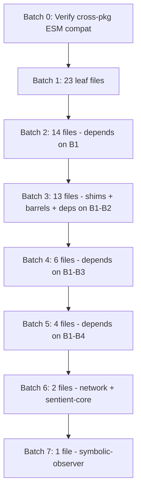

# ESM Migration Plan — `apps/sentient/lib/`

> **Generated:** 2026-02-23  
> **Scope:** All `.js` files under `apps/sentient/lib/`  
> **Root `package.json`** has `"type": "module"` — all `.js` files must use ESM syntax.

---

## Table of Contents

1. [Summary](#1-summary)
2. [Already Migrated Files](#2-already-migrated-files)
3. [Remaining CJS Files — Full Dependency Graph](#3-remaining-cjs-files--full-dependency-graph)
4. [Cross-Package Dependencies](#4-cross-package-dependencies)
5. [Special Cases](#5-special-cases)
6. [Migration Batches](#6-migration-batches)
7. [Migration Checklist per File](#7-migration-checklist-per-file)

---

## 1. Summary

| Category | Count |
|---|---|
| Total `.js` files in `apps/sentient/lib/` | ~90 |
| Already migrated to ESM | 37 |
| Remaining CJS files | **53** |
| Pure re-export shims | 6 |
| Files with dynamic `require()` | 3 |
| Files using `__dirname` / `__filename` (CJS only) | 1 |
| Migration batches needed | 8 |

---

## 2. Already Migrated Files

These files already use `import` / `export` syntax and need no changes:

| # | File | Notes |
|---|---|---|
| 1 | `index.js` | Barrel — uses ESM `import` from CJS deps (will break until deps migrate) |
| 2 | `askChaperone.js` | ESM, uses `fileURLToPath` polyfill for `__dirname` |
| 3 | `chat.js` | ESM |
| 4 | `lmstudio.js` | ESM |
| 5 | `vertex-ai.js` | ESM |
| 6 | `providers/index.js` | ESM |
| 7 | `app/index.js` | ESM |
| 8 | `app/args.js` | ESM |
| 9 | `app/cli.js` | ESM |
| 10 | `app/constants.js` | ESM |
| 11 | `app/shared.js` | ESM |
| 12 | `app/server.js` | ESM, uses `fileURLToPath` polyfill |
| 13 | `app/server/index.js` | ESM |
| 14 | `app/server/chat-handler.js` | ESM |
| 15 | `app/server/learning-routes.js` | ESM |
| 16 | `app/server/network-sync.js` | ESM |
| 17 | `app/server/observer-routes.js` | ESM |
| 18 | `app/server/provider-routes.js` | ESM |
| 19 | `app/server/static-server.js` | ESM |
| 20 | `app/server/stream-routes.js` | ESM |
| 21 | `app/server/utils.js` | ESM |
| 22 | `app/server/webrtc-routes.js` | ESM |
| 23 | `webrtc/coordinator.js` | ESM |
| 24 | `webrtc/index.js` | ESM |
| 25 | `webrtc/peer.js` | ESM |
| 26 | `webrtc/room.js` | ESM |
| 27 | `webrtc/transport.js` | ESM |
| 28 | `learning/chaperone.js` | ESM |
| 29 | `learning/config.js` | ESM, uses `fileURLToPath` polyfill |
| 30 | `learning/curiosity.js` | ESM |
| 31 | `learning/index.js` | ESM |
| 32 | `learning/ingester.js` | ESM |
| 33 | `learning/learner.js` | ESM |
| 34 | `learning/next-steps.js` | ESM |
| 35 | `learning/query.js` | ESM |
| 36 | `learning/reflector.js` | ESM |
| 37 | `learning/safety-filter.js` | ESM |

---

## 3. Remaining CJS Files — Full Dependency Graph

### Legend
- **Imports** = what the file `require()`s
- **Imported by** = which files `require()` this file
- **Local** = within `apps/sentient/lib/`
- **External** = npm packages or Node.js built-ins
- **Cross-pkg** = from `observer/`, `core/`, `physics/`, etc.

---

### 3.1 Re-export Shims (6 files)

These files are one-liners: `module.exports = require('...')`.

| File | Re-exports From | Imported By |
|---|---|---|
| `smf.js` | `observer/smf` | `specialization.js`, `collective.js`, `memory-manager.js`, `symbolic-smf.js`, `symbolic-observer.js`, `sentient-core.js`, `network.js` |
| `prsc.js` | `observer/prsc` | `sentient-core.js` |
| `temporal.js` | `observer/temporal` | `symbolic-temporal.js`, `sentient-memory.js`, `sentient-core.js`, `symbolic-observer.js` |
| `entanglement.js` | `observer/entanglement` | `sentient-memory.js`, `sentient-core.js` |
| `agency.js` | `observer/agency` | `sentient-core.js` |
| `boundary.js` | `observer/boundary` | `sentient-core.js` |
| `safety.js` | `observer/safety` | `sentient-core.js` |

### 3.2 Leaf Files (no local imports)

| File | Imports (external only) | Imported By |
|---|---|---|
| `assays.js` | *(none)* | `index.js` (ESM) |
| `topics.js` | *(none)* | `core.js` |
| `processor.js` | *(none)* | `index.js` (ESM) |
| `senses/base.js` | *(none)* | all other `senses/*.js` |
| `quantum/math.js` | *(none)* | `quantum/analyzer.js`, `quantum/network.js`, `tools/quantum-scanner.js` |
| `tools/file-editor/prompts.js` | *(none)* | `tools/file-editor/llmBridge.js` |
| `tools/file-editor/patchEngine.js` | *(none)* | `tools/file-editor/index.js`, `tools/file-editor/transaction.js` |
| `abstraction.js` | `events` | `index.js` (ESM) |
| `agent.js` | `events` | `index.js` (ESM) |
| `profiler.js` | `events`, `perf_hooks` | *(standalone)* |
| `error-handler.js` | `events` | `secure-config.js` |
| `telemetry.js` | `events`, `http` | `network.js` (dynamic) |
| `transport/index.js` | `events` | *(standalone)* |
| `speech.js` | `child_process`, `fs`, `path`, `https`, `http` | *(standalone)* |
| `binary-serializer.js` | `fs`, `path`, `zlib`, `crypto` | *(standalone)* |
| `snapshot-integrity.js` | `fs`, `path`, `crypto`, `zlib`, `util` | *(standalone)* |
| `memory-broker.js` | `events`, `fs`, `path`, `crypto` | *(standalone)* |

### 3.3 Files With Local Dependencies

| File | Local Imports | Cross-Pkg Imports | External Imports | Imported By |
|---|---|---|---|---|
| `vocabulary.js` | *(none)* | *(none)* | `fs`, `path` | `core.js` |
| `style.js` | *(none)* | *(none)* | `fs`, `path` | `core.js` |
| `concepts.js` | *(none)* | *(none)* | `fs`, `path` | `core.js` |
| `memory.js` | *(none)* | *(none)* | `fs`, `path` | `core.js` |
| `markdown.js` | *(none)* | *(none)* | `vm` | `index.js` (ESM) |
| `resolang.js` | *(none)* | *(none)* | `fs`, `path` | `index.js` (ESM) |
| `enochian-vocabulary.js` | *(none)* | `core/prime` | *(none)* | `enochian.js` |
| `learning/prompt-cache.js` | *(none)* | *(none)* | `crypto`, `fs`, `path`, `events` | *(standalone, in learning/)* |
| `senses/chrono.js` | `senses/base` | *(none)* | *(none)* | `senses/index.js` |
| `senses/proprio.js` | `senses/base` | *(none)* | *(none)* | `senses/index.js` |
| `senses/network.js` | `senses/base` | *(none)* | *(none)* | `senses/index.js` |
| `senses/user.js` | `senses/base` | *(none)* | *(none)* | `senses/index.js` |
| `senses/sight.js` | `senses/base` | *(none)* | *(none)* | `senses/index.js` |
| `senses/process.js` | `senses/base` | *(none)* | `os` | `senses/index.js` |
| `senses/filesystem.js` | `senses/base` | *(none)* | `fs`, `path` | `senses/index.js` |
| `senses/git.js` | `senses/base` | *(none)* | `child_process`, `path` | `senses/index.js` |
| `senses/index.js` | `senses/base`, `senses/chrono`, `senses/proprio`, `senses/filesystem`, `senses/git`, `senses/process`, `senses/network`, `senses/user`, `senses/sight` | *(none)* | *(none)* | *(standalone)* |
| `quantum/analyzer.js` | `quantum/math` | *(none)* | *(none)* | `tools/quantum-scanner.js` |
| `quantum/network.js` | `quantum/math` | *(none)* | *(none)* | `tools/quantum-scanner.js` |
| `tools/file-editor/llmBridge.js` | `tools/file-editor/prompts` | *(none)* | *(none)* | `tools/file-editor/index.js` |
| `tools/file-editor/transaction.js` | `tools/file-editor/patchEngine` | *(none)* | `fs`, `path`, `crypto` | *(standalone)* |
| `tools/file-editor/index.js` | `tools/file-editor/llmBridge`, `tools/file-editor/patchEngine` | *(none)* | `fs`, `path` | `tools.js` |
| `tools/quantum-scanner.js` | `quantum/math`, `quantum/analyzer`, `quantum/network` | *(none)* | *(none)* | `tools.js` |
| `core.js` | `vocabulary`, `style`, `topics`, `concepts`, `memory` | *(none)* | *(none)* | `index.js` (ESM) |
| `enhancer.js` | `tools` | *(none)* | *(none)* | `index.js` (ESM) |
| `tools.js` | `askChaperone` (ESM), `tools/file-editor`, `tools/quantum-scanner` | *(none)* | `fs`, `path`, `crypto`, `child_process` | `enhancer.js`, `index.js` (ESM) |
| `specialization.js` | `smf` | *(none)* | *(none)* | `routing.js` |
| `routing.js` | `specialization` | *(none)* | `events` | *(standalone)* |
| `collective.js` | `smf` | *(none)* | `events` | `index.js` (ESM) |
| `memory-manager.js` | `smf` | *(none)* | `events` | *(standalone)* |
| `secure-config.js` | `error-handler` | *(none)* | `fs`, `path`, `crypto` | *(standalone)* |
| `enochian.js` | `enochian-vocabulary` | *(none)* | *(none)* | `network.js`, `index.js` (ESM) |
| `prime-calculus.js` | *(none)* | *(none)* | *(none)* | `network.js`, `index.js` (ESM) |
| `hqe.js` | *(none)* | `core/hilbert`, `core/prime` | `crypto`, `fs`, `path`, `os` | `sentient-memory.js`, `sentient-core.js` |
| `symbolic-smf.js` | `smf` | `core/symbols`, `core/inference`, `core/compound`, `core/resonance` | *(none)* | `symbolic-observer.js` |
| `symbolic-temporal.js` | `temporal` | `core/rformer`, `core/symbols` | *(none)* | `symbolic-observer.js` |
| `sentient-memory.js` | `hqe`, `entanglement`, `temporal` | `core/hilbert`, `core/rformer`, `physics/primeon_z_ladder_multi` | `fs`, `path` | `sentient-core.js` |
| `network.js` | `smf`, `prime-calculus`, `enochian` | *(none)* | `events`, `crypto` | `index.js` (ESM) |
| `sentient-core.js` | `smf`, `prsc`, `hqe`, `temporal`, `entanglement`, `sentient-memory`, `agency`, `boundary`, `safety` | `core/hilbert`, `core/prime`, `core/events`, `core/rformer` | *(none)* | `symbolic-observer.js` |
| `symbolic-observer.js` | `sentient-core`, `symbolic-smf`, `symbolic-temporal`, `smf`, `temporal` | `core/symbols`, `core/inference`, `core/compound`, `core/resonance`, `core/topology` | *(none)* | `index.js` (ESM) |

---

## 4. Cross-Package Dependencies

Files in `apps/sentient/lib/` that import from outside the directory:

| Source File | External Import | Package |
|---|---|---|
| `smf.js` | `require('../../../observer/smf')` | `observer/` |
| `prsc.js` | `require('../../../observer/prsc')` | `observer/` |
| `temporal.js` | `require('../../../observer/temporal')` | `observer/` |
| `entanglement.js` | `require('../../../observer/entanglement')` | `observer/` |
| `agency.js` | `require('../../../observer/agency')` | `observer/` |
| `boundary.js` | `require('../../../observer/boundary')` | `observer/` |
| `safety.js` | `require('../../../observer/safety')` | `observer/` |
| `hqe.js` | `require('../../../core/hilbert')`, `require('../../../core/prime')` | `core/` |
| `enochian-vocabulary.js` | `require('../../../core/prime')` | `core/` |
| `sentient-memory.js` | `require('../../../core/hilbert')`, `require('../../../core/rformer')`, `require('../../../physics/primeon_z_ladder_multi')` | `core/`, `physics/` |
| `sentient-core.js` | `require('../../../core/hilbert')`, `require('../../../core/prime')`, `require('../../../core/events')`, `require('../../../core/rformer')` | `core/` |
| `symbolic-smf.js` | `require('../../../core/symbols')`, `require('../../../core/inference')`, `require('../../../core/compound')`, `require('../../../core/resonance')` | `core/` |
| `symbolic-temporal.js` | `require('../../../core/rformer')`, `require('../../../core/symbols')` | `core/` |
| `symbolic-observer.js` | `require('../../../core/symbols')`, `require('../../../core/inference')`, `require('../../../core/compound')`, `require('../../../core/resonance')`, `require('../../../core/topology')` | `core/` |
| `network.js` | `require('./telemetry')` (dynamic), `require('@sschepis/resolang')` (dynamic) | npm |
| `prime-calculus.js` | `require('@sschepis/resolang')` (dynamic) | npm |

> **Note:** The `observer/` and `core/` packages must also support ESM imports. If they still use CJS `module.exports`, the re-export shims will need `import ... from` syntax with the appropriate path + `.js` extension. The cross-package files likely use `module.exports` patterns and may need their own ESM migration, or `createRequire()` may be needed temporarily.

---

## 5. Special Cases

### 5.1 Pure Re-export Shims (6 files)

These are trivial to migrate — replace the one-liner with ESM re-export:

```js
// Before (CJS)
module.exports = require('../../../observer/smf');

// After (ESM)
export { default } from '../../../observer/smf.js';
// OR, if named exports are needed:
export * from '../../../observer/smf.js';
```

**Files:** `smf.js`, `prsc.js`, `temporal.js`, `entanglement.js`, `agency.js`, `boundary.js`, `safety.js`

### 5.2 Dynamic `require()` (3 files)

These use `require()` inside `try/catch` for optional dependencies:

| File | Dynamic Require | Migration Strategy |
|---|---|---|
| `network.js` (line 33) | `telemetry = require('./telemetry')` | Use dynamic `import()` in an async init or `try { const m = await import('./telemetry.js'); telemetry = m; } catch {}` |
| `network.js` (line 41) | `resolang = require('@sschepis/resolang')` | Same dynamic `import()` pattern |
| `prime-calculus.js` (line 25) | `resolang = require('@sschepis/resolang')` | Same dynamic `import()` pattern |
| `enochian.js` (line 26) | `resolang = require('@sschepis/resolang')` | Same dynamic `import()` pattern |

### 5.3 `__dirname` / `__filename` Usage (1 CJS file)

| File | Usage | Migration |
|---|---|---|
| `resolang.js` (line 34) | `path.join(__dirname, ...)` | Add ESM polyfill: `const __filename = fileURLToPath(import.meta.url); const __dirname = path.dirname(__filename);` |

### 5.4 Conditional `module.exports` Pattern (3 files)

The `quantum/` files use `if (typeof module !== 'undefined' && module.exports)` guard:

| File | Pattern |
|---|---|
| `quantum/math.js` | `if (typeof module !== 'undefined' && module.exports) { module.exports = {...} }` |
| `quantum/analyzer.js` | Same pattern |
| `quantum/network.js` | Same pattern |
| `tools/quantum-scanner.js` | Same pattern |

**Migration:** Remove the conditional, use `export { ... }` directly.

### 5.5 `module.exports = { ... }` Pattern (most files)

The majority of files use `module.exports = { Class1, Class2, func1 }`. Convert to:

```js
export { Class1, Class2, func1 };
```

### 5.6 `VM` module usage

| File | Notes |
|---|---|
| `markdown.js` | Uses `const { VM } = require('vm')`. The `vm` module works in ESM — just change to `import { VM } from 'vm'`. |

---

## 6. Migration Batches

Files must be migrated bottom-up: leaf dependencies first, then files that depend on them.

### Batch 0 — Pre-requisite: Verify Cross-Package ESM Compatibility

Before migrating, verify that these external packages support ESM `import`:
- `observer/smf.js`, `observer/prsc.js`, `observer/temporal.js`, `observer/entanglement.js`, `observer/agency.js`, `observer/boundary.js`, `observer/safety.js`
- `core/hilbert.js`, `core/prime.js`, `core/events.js`, `core/rformer.js`, `core/symbols.js`, `core/inference.js`, `core/compound.js`, `core/resonance.js`, `core/topology.js`
- `physics/primeon_z_ladder_multi.js`

If any of these still use CJS `module.exports`, they either need to be migrated first or accessed via `createRequire()` bridge.

---

### Batch 1 — Leaf Nodes (no local dependencies) — 23 files

These files import only Node.js built-ins, npm packages, or nothing at all.

| # | File | Imports | Export Pattern | Notes |
|---|---|---|---|---|
| 1 | `assays.js` | *(none)* | `module.exports = { ... }` | 4 classes + 1 suite |
| 2 | `topics.js` | *(none)* | `module.exports = { TopicTracker }` | |
| 3 | `processor.js` | *(none)* | `module.exports = { ResponseProcessor }` | |
| 4 | `vocabulary.js` | `fs`, `path` | `module.exports = { VocabularyManager }` | |
| 5 | `style.js` | `fs`, `path` | `module.exports = { StyleProfiler }` | |
| 6 | `concepts.js` | `fs`, `path` | `module.exports = { ConceptGraph }` | |
| 7 | `memory.js` | `fs`, `path` | `module.exports = { ContextMemory, ... }` | |
| 8 | `markdown.js` | `vm` | `module.exports = { MarkdownRenderer, ... }` | |
| 9 | `resolang.js` | `fs`, `path` | `module.exports = { ResolangLoader, ... }` | Uses `__dirname` — needs polyfill |
| 10 | `agent.js` | `events` | `module.exports = { TaskStatus, ..., Agent, createAgent }` | Enums + classes |
| 11 | `abstraction.js` | `events` | `module.exports = { FusionDiscoveryEngine, ... }` | |
| 12 | `profiler.js` | `events`, `perf_hooks` | `module.exports = { ... }` | |
| 13 | `error-handler.js` | `events` | `module.exports = { ... }` | |
| 14 | `telemetry.js` | `events`, `http` | `module.exports = { ... }` | |
| 15 | `transport/index.js` | `events` | `module.exports = { ... }` | |
| 16 | `speech.js` | `child_process`, `fs`, `path`, `https`, `http` | `module.exports = { ... }` | |
| 17 | `binary-serializer.js` | `fs`, `path`, `zlib`, `crypto` | `module.exports = { ... }` | |
| 18 | `snapshot-integrity.js` | `fs`, `path`, `crypto`, `zlib`, `util` | `module.exports = { ... }` | |
| 19 | `memory-broker.js` | `events`, `fs`, `path`, `crypto` | `module.exports = { ... }` | |
| 20 | `senses/base.js` | *(none)* | `module.exports = { Sense }` | |
| 21 | `quantum/math.js` | *(none)* | Conditional `module.exports` | Remove guard |
| 22 | `tools/file-editor/prompts.js` | *(none)* | `module.exports = { SYSTEM_PROMPT }` | |
| 23 | `tools/file-editor/patchEngine.js` | *(none)* | `module.exports = { ... }` | |

---

### Batch 2 — Depends on Batch 1 only — 14 files

| # | File | Local Deps (all from Batch 1) | Notes |
|---|---|---|---|
| 1 | `core.js` | `vocabulary`, `style`, `topics`, `concepts`, `memory` | |
| 2 | `secure-config.js` | `error-handler` | |
| 3 | `senses/chrono.js` | `senses/base` | |
| 4 | `senses/proprio.js` | `senses/base` | |
| 5 | `senses/network.js` | `senses/base` | |
| 6 | `senses/user.js` | `senses/base` | |
| 7 | `senses/sight.js` | `senses/base` | |
| 8 | `senses/process.js` | `senses/base` | |
| 9 | `senses/filesystem.js` | `senses/base` | |
| 10 | `senses/git.js` | `senses/base` | |
| 11 | `quantum/analyzer.js` | `quantum/math` | Conditional exports — remove guard |
| 12 | `quantum/network.js` | `quantum/math` | Conditional exports — remove guard |
| 13 | `tools/file-editor/llmBridge.js` | `tools/file-editor/prompts` | |
| 14 | `tools/file-editor/transaction.js` | `tools/file-editor/patchEngine` | |

---

### Batch 3 — Depends on Batch 1–2 — 7 files

| # | File | Local Deps | Notes |
|---|---|---|---|
| 1 | `senses/index.js` | all `senses/*.js` (Batch 1–2) | Barrel file for senses subsystem |
| 2 | `tools/file-editor/index.js` | `llmBridge` (B2), `patchEngine` (B1) | |
| 3 | `tools/quantum-scanner.js` | `quantum/math` (B1), `quantum/analyzer` (B2), `quantum/network` (B2) | Conditional exports — remove guard |
| 4 | `enochian-vocabulary.js` | *(none local)* | Cross-pkg: `core/prime` |
| 5 | `prime-calculus.js` | *(none local)* | Dynamic `require('@sschepis/resolang')` — use `import()` |
| 6 | `learning/prompt-cache.js` | *(none local)* | Only uses Node built-ins; in learning/ dir but still CJS |
| 7 | `collective.js` | `smf` (re-export shim — convert in B4) | Move to B5 if smf needs to be done first. **Alternative:** convert `smf.js` shim in this batch too. |

> **Decision point for `collective.js`**: It depends on `smf.js` which is a re-export shim. Since shims are trivial, we can convert `smf.js` and all 6 re-export shims as part of Batch 3.

**Revised Batch 3** — also includes all 6 re-export shims:

| # | File | Notes |
|---|---|---|
| 1–6 | `smf.js`, `prsc.js`, `temporal.js`, `entanglement.js`, `agency.js`, `boundary.js`, `safety.js` | Convert `module.exports = require(...)` → `export * from '...'` |
| 7 | `senses/index.js` | Barrel |
| 8 | `tools/file-editor/index.js` | |
| 9 | `tools/quantum-scanner.js` | |
| 10 | `enochian-vocabulary.js` | Cross-pkg: `core/prime` |
| 11 | `prime-calculus.js` | Dynamic `require` → `import()` |
| 12 | `learning/prompt-cache.js` | |
| 13 | `collective.js` | Depends on `smf` (now converted) |

---

### Batch 4 — Depends on Batch 1–3 — 6 files

| # | File | Local Deps | Cross-Pkg Deps | Notes |
|---|---|---|---|---|
| 1 | `tools.js` | `askChaperone` (ESM ✓), `tools/file-editor` (B3), `tools/quantum-scanner` (B3) | *(none)* | |
| 2 | `enochian.js` | `enochian-vocabulary` (B3) | *(none)* | Dynamic `require('@sschepis/resolang')` |
| 3 | `hqe.js` | *(none local)* | `core/hilbert`, `core/prime` | Uses `fs`, `path`, `os`, `crypto` |
| 4 | `specialization.js` | `smf` (B3) | *(none)* | |
| 5 | `memory-manager.js` | `smf` (B3) | *(none)* | |
| 6 | `symbolic-smf.js` | `smf` (B3) | `core/symbols`, `core/inference`, `core/compound`, `core/resonance` | |

---

### Batch 5 — Depends on Batch 1–4 — 4 files

| # | File | Local Deps | Cross-Pkg Deps |
|---|---|---|---|
| 1 | `enhancer.js` | `tools` (B4) | *(none)* |
| 2 | `routing.js` | `specialization` (B4) | *(none)* |
| 3 | `symbolic-temporal.js` | `temporal` (B3 shim) | `core/rformer`, `core/symbols` |
| 4 | `sentient-memory.js` | `hqe` (B4), `entanglement` (B3), `temporal` (B3) | `core/hilbert`, `core/rformer`, `physics/primeon_z_ladder_multi` |

---

### Batch 6 — Depends on Batch 1–5 — 2 files

| # | File | Local Deps | Cross-Pkg Deps |
|---|---|---|---|
| 1 | `network.js` | `smf` (B3), `prime-calculus` (B3), `enochian` (B4), `telemetry` (B1, dynamic) | *(none)* |
| 2 | `sentient-core.js` | `smf` (B3), `prsc` (B3), `hqe` (B4), `temporal` (B3), `entanglement` (B3), `sentient-memory` (B5), `agency` (B3), `boundary` (B3), `safety` (B3) | `core/hilbert`, `core/prime`, `core/events`, `core/rformer` |

---

### Batch 7 — Final (depends on Batch 6) — 1 file

| # | File | Local Deps |
|---|---|---|
| 1 | `symbolic-observer.js` | `sentient-core` (B6), `symbolic-smf` (B4), `symbolic-temporal` (B5), `smf` (B3), `temporal` (B3) |

---

### Batch Summary



---

## 7. Migration Checklist per File

For each CJS file, apply these transformations:

### Standard Conversion Steps

1. **Replace `require()` with `import`:**
   ```js
   // Before
   const { Foo } = require('./bar');
   const fs = require('fs');
   
   // After
   import { Foo } from './bar.js';
   import fs from 'fs';
   ```

2. **Replace `module.exports` with `export`:**
   ```js
   // Before
   module.exports = { Foo, Bar, baz };
   
   // After
   export { Foo, Bar, baz };
   ```

3. **Add `.js` extension** to all relative import paths.

4. **Replace dynamic `require()` with `import()`:**
   ```js
   // Before
   try { resolang = require('@sschepis/resolang'); } catch {}
   
   // After
   try { resolang = await import('@sschepis/resolang'); } catch {}
   // Note: if in module scope, wrap in async IIFE or init function
   ```

5. **Add `__dirname` polyfill where needed:**
   ```js
   import { fileURLToPath } from 'url';
   import path from 'path';
   const __filename = fileURLToPath(import.meta.url);
   const __dirname = path.dirname(__filename);
   ```

6. **Remove conditional export guards:**
   ```js
   // Remove this pattern entirely:
   if (typeof module !== 'undefined' && module.exports) {
       module.exports = { ... };
   }
   // Replace with:
   export { ... };
   ```

7. **Convert re-export shims:**
   ```js
   // Before
   module.exports = require('../../../observer/smf');
   
   // After — choose based on what the observer module exports:
   export * from '../../../observer/smf.js';
   // OR if it has a default export:
   export { default } from '../../../observer/smf.js';
   // OR re-export both:
   export * from '../../../observer/smf.js';
   export { default } from '../../../observer/smf.js';
   ```

### Testing After Each Batch

After converting each batch:
1. Run `node --check <file>` on each converted file to verify syntax
2. Run the test suite: `npm test`
3. Verify no `require()` or `module.exports` remain in converted files:
   ```bash
   grep -rn 'require(' apps/sentient/lib/<batch-files> | grep -v node_modules
   grep -rn 'module.exports' apps/sentient/lib/<batch-files>
   ```

---

## Appendix: Files Not Imported by Anything in lib/

These files may be entry points, test utilities, or dead code:

| File | Notes |
|---|---|
| `profiler.js` | May be imported at runtime / used externally |
| `speech.js` | Standalone speech module |
| `binary-serializer.js` | Standalone serialization utility |
| `snapshot-integrity.js` | Standalone integrity checker |
| `memory-broker.js` | Standalone memory broker |
| `transport/index.js` | Standalone transport layer |
| `routing.js` | May be imported by app layer |
| `memory-manager.js` | May be imported by app layer |
| `secure-config.js` | May be imported by app layer |
| `senses/index.js` | May be imported by app layer |
| `learning/prompt-cache.js` | May be imported by learning subsystem at runtime |
| `tools/file-editor/transaction.js` | May be imported externally |

These should still be migrated but verify they are actually used before investing effort.
