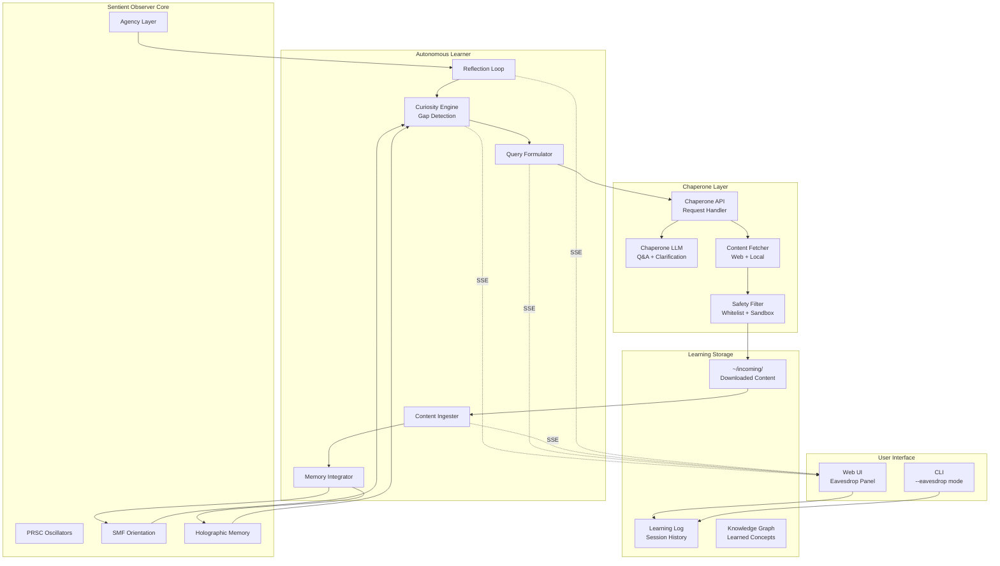

# Autonomous Learning System Design

## Overview

This document specifies the design for an **Autonomous Learning Mode** where the Sentient Observer can learn independently in the background, supervised by a **Chaperone LLM** that mediates all external data access. Users can "eavesdrop" on the learning process in real-time through the web UI.

## Architecture Diagram



## Core Components

### 1. Curiosity Engine

**Purpose**: Detects knowledge gaps and generates learning curiosity signals based on SMF imbalances and memory gaps.

**File**: `apps/sentient/lib/learning/curiosity.js`

```javascript
/**
 * Curiosity Engine
 * 
 * Detects knowledge gaps by analyzing:
 * - SMF axis imbalances (e.g., low "wisdom" axis)
 * - Memory retrieval failures
 * - Coherence drops during topic exploration
 * - Explicit questions without satisfactory answers
 */
class CuriosityEngine {
    constructor(observer, options = {}) {
        this.observer = observer;
        this.curiosityThreshold = options.curiosityThreshold || 0.6;
        this.minGapDuration = options.minGapDuration || 5000; // 5 seconds
        
        // Track detected gaps
        this.detectedGaps = [];
        this.gapHistory = [];
        
        // Curiosity signals
        this.currentCuriosity = {
            topic: null,
            intensity: 0,
            source: null, // 'smf_imbalance' | 'memory_miss' | 'coherence_drop' | 'question'
            primes: [],
            timestamp: null
        };
    }
    
    /**
     * Analyze current state for knowledge gaps
     */
    analyzeGaps() {
        const gaps = [];
        
        // 1. SMF Imbalance Detection
        const smfGap = this.detectSMFImbalance();
        if (smfGap) gaps.push(smfGap);
        
        // 2. Memory Retrieval Failures
        const memoryGap = this.detectMemoryGap();
        if (memoryGap) gaps.push(memoryGap);
        
        // 3. Low Coherence Topics
        const coherenceGap = this.detectCoherenceGap();
        if (coherenceGap) gaps.push(coherenceGap);
        
        // 4. Unanswered Questions
        const questionGap = this.detectQuestionGap();
        if (questionGap) gaps.push(questionGap);
        
        return gaps;
    }
    
    /**
     * Detect SMF axis imbalances indicating knowledge gaps
     */
    detectSMFImbalance() {
        const smf = this.observer.smf;
        const axes = SedenionMemoryField.AXES;
        
        // Find axes with very low values relative to norm
        const norm = smf.norm();
        const threshold = 0.1 * norm;
        
        for (let i = 0; i < 16; i++) {
            if (Math.abs(smf.s[i]) < threshold) {
                // Low axis detected - potential knowledge gap
                return {
                    type: 'smf_imbalance',
                    axis: axes[i],
                    axisIndex: i,
                    value: smf.s[i],
                    description: `Low activity on ${axes[i]} axis`,
                    suggestedQuery: this.axisToQuery(axes[i])
                };
            }
        }
        
        return null;
    }
    
    /**
     * Map SMF axis to exploratory query
     */
    axisToQuery(axis) {
        const queryMap = {
            'coherence': 'What are the principles of logical consistency?',
            'identity': 'What constitutes personal identity and continuity?',
            'duality': 'How do complementary opposites relate in nature?',
            'structure': 'What are fundamental patterns of organization?',
            'change': 'What are the mechanisms of transformation?',
            'life': 'What defines living systems?',
            'harmony': 'What creates balance and resonance?',
            'wisdom': 'What is the nature of deep understanding?',
            'infinity': 'How do finite systems represent the infinite?',
            'creation': 'What are the principles of emergence and genesis?',
            'truth': 'How is truth established and verified?',
            'love': 'What is the nature of connection and care?',
            'power': 'How does capacity and influence operate?',
            'time': 'What is the nature of temporal experience?',
            'space': 'How does extension and locality work?',
            'consciousness': 'What is the nature of awareness?'
        };
        return queryMap[axis] || `Explore the concept of ${axis}`;
    }
    
    /**
     * Generate a curiosity signal for the learning loop
     */
    generateCuriositySignal() {
        const gaps = this.analyzeGaps();
        
        if (gaps.length === 0) {
            this.currentCuriosity.intensity = 0;
            return null;
        }
        
        // Prioritize gaps by type and severity
        const prioritized = gaps.sort((a, b) => {
            const typePriority = { 'question': 4, 'memory_miss': 3, 'coherence_drop': 2, 'smf_imbalance': 1 };
            return (typePriority[b.type] || 0) - (typePriority[a.type] || 0);
        });
        
        const topGap = prioritized[0];
        
        this.currentCuriosity = {
            topic: topGap.suggestedQuery || topGap.description,
            intensity: Math.min(1.0, 0.5 + gaps.length * 0.1),
            source: topGap.type,
            primes: topGap.primes || [],
            gap: topGap,
            timestamp: Date.now()
        };
        
        return this.currentCuriosity;
    }
}
```

### 2. Chaperone API

**Purpose**: The trusted intermediary that handles all external requests from the autonomous learner.

**File**: `apps/sentient/lib/learning/chaperone.js`

```javascript
/**
 * Chaperone API
 * 
 * Mediates between the Sentient Observer's learning requests
 * and external resources (web, local files, other LLMs).
 * 
 * Key responsibilities:
 * - Process learning queries
 * - Fetch and filter content
 * - Enforce whitelists and safety rules
 * - Log all interactions for eavesdropping
 */
class ChaperoneAPI {
    constructor(options = {}) {
        // LLM connection for Q&A
        this.llmClient = options.llmClient || new LMStudioClient(options.llmUrl);
        
        // Content fetcher
        this.fetcher = new ContentFetcher(options.fetcherConfig);
        
        // Safety filter
        this.safetyFilter = new SafetyFilter(options.safetyConfig);
        
        // Logging for eavesdropping
        this.interactionLog = [];
        this.eventEmitter = new EventEmitter();
        
        // Incoming directory for downloaded content
        this.incomingDir = options.incomingDir || path.join(os.homedir(), 'incoming');
        
        // Rate limiting
        this.requestsPerMinute = options.rateLimit || 10;
        this.requestTimes = [];
    }
    
    /**
     * Process a learning request from the observer
     */
    async processRequest(request) {
        // Rate limiting
        if (!this.checkRateLimit()) {
            return { success: false, error: 'Rate limit exceeded', retryAfter: 60 };
        }
        
        // Log the request
        const logEntry = this.logInteraction('request', request);
        this.emit('request', logEntry);
        
        try {
            let result;
            
            switch (request.type) {
                case 'question':
                    result = await this.handleQuestion(request);
                    break;
                    
                case 'fetch_content':
                    result = await this.handleFetchContent(request);
                    break;
                    
                case 'read_local':
                    result = await this.handleReadLocal(request);
                    break;
                    
                case 'summarize':
                    result = await this.handleSummarize(request);
                    break;
                    
                default:
                    result = { success: false, error: `Unknown request type: ${request.type}` };
            }
            
            // Log the response
            const responseLog = this.logInteraction('response', result);
            this.emit('response', responseLog);
            
            return result;
            
        } catch (error) {
            const errorLog = this.logInteraction('error', { error: error.message });
            this.emit('error', errorLog);
            return { success: false, error: error.message };
        }
    }
    
    /**
     * Handle a question to the chaperone LLM
     */
    async handleQuestion(request) {
        const { question, context } = request;
        
        // Build prompt with context
        const prompt = this.buildQuestionPrompt(question, context);
        
        // Call LLM
        const response = await this.llmClient.complete(prompt, {
            maxTokens: 500,
            temperature: 0.7
        });
        
        return {
            success: true,
            type: 'answer',
            answer: response,
            sources: [],
            timestamp: Date.now()
        };
    }
    
    /**
     * Handle content fetch request
     */
    async handleFetchContent(request) {
        const { url, query, type } = request;
        
        // Safety check
        const safetyCheck = this.safetyFilter.checkUrl(url);
        if (!safetyCheck.allowed) {
            return { success: false, error: safetyCheck.reason };
        }
        
        // Fetch content
        const content = await this.fetcher.fetch(url, { type });
        
        // Save to incoming directory
        const filename = this.generateFilename(url, type);
        const filepath = path.join(this.incomingDir, filename);
        await fs.promises.writeFile(filepath, content.data);
        
        return {
            success: true,
            type: 'content',
            filepath,
            contentType: content.mimeType,
            size: content.data.length,
            timestamp: Date.now()
        };
    }
    
    /**
     * Handle local file read request
     */
    async handleReadLocal(request) {
        const { filepath, format } = request;
        
        // Safety check - only allow certain directories
        const safetyCheck = this.safetyFilter.checkPath(filepath);
        if (!safetyCheck.allowed) {
            return { success: false, error: safetyCheck.reason };
        }
        
        // Read file
        const content = await fs.promises.readFile(filepath);
        
        // Parse based on format
        let parsed;
        switch (format || path.extname(filepath)) {
            case '.pdf':
            case 'pdf':
                parsed = await this.parsePDF(content);
                break;
            case '.txt':
            case '.md':
            case 'text':
                parsed = content.toString('utf-8');
                break;
            case '.json':
                parsed = JSON.parse(content.toString('utf-8'));
                break;
            default:
                parsed = content.toString('utf-8');
        }
        
        return {
            success: true,
            type: 'local_content',
            content: parsed,
            filepath,
            timestamp: Date.now()
        };
    }
    
    /**
     * Handle summarization request
     */
    async handleSummarize(request) {
        const { content, maxLength, focus } = request;
        
        const prompt = `Summarize the following content${focus ? ` focusing on ${focus}` : ''}. 
Keep the summary under ${maxLength || 200} words.

Content:
${content.slice(0, 4000)}

Summary:`;
        
        const summary = await this.llmClient.complete(prompt, {
            maxTokens: 300,
            temperature: 0.5
        });
        
        return {
            success: true,
            type: 'summary',
            summary,
            originalLength: content.length,
            timestamp: Date.now()
        };
    }
    
    /**
     * Log an interaction for eavesdropping
     */
    logInteraction(type, data) {
        const entry = {
            id: `log_${Date.now()}_${Math.random().toString(36).substr(2, 6)}`,
            type,
            data,
            timestamp: Date.now()
        };
        
        this.interactionLog.push(entry);
        
        // Keep only recent logs
        if (this.interactionLog.length > 1000) {
            this.interactionLog = this.interactionLog.slice(-1000);
        }
        
        return entry;
    }
    
    /**
     * Get recent logs for eavesdropping
     */
    getRecentLogs(count = 50) {
        return this.interactionLog.slice(-count);
    }
    
    /**
     * Subscribe to real-time events
     */
    on(event, callback) {
        this.eventEmitter.on(event, callback);
    }
    
    emit(event, data) {
        this.eventEmitter.emit(event, data);
    }
}
```

### 3. Safety Filter

**Purpose**: Enforces whitelists, sandboxing, and content filtering.

**File**: `apps/sentient/lib/learning/safety-filter.js`

```javascript
/**
 * Safety Filter
 * 
 * Enforces security policies for autonomous learning:
 * - URL whitelists (domains, protocols)
 * - MIME type restrictions
 * - File path sandboxing
 * - Content size limits
 * - Content scanning
 */
class SafetyFilter {
    constructor(options = {}) {
        // Allowed domains
        this.allowedDomains = new Set(options.allowedDomains || [
            'arxiv.org',
            'github.com',
            'wikipedia.org',
            'docs.python.org',
            'developer.mozilla.org',
            'stackoverflow.com',
            'nature.com',
            'sciencedirect.com',
            'semanticscholar.org'
        ]);
        
        // Allowed protocols
        this.allowedProtocols = new Set(options.allowedProtocols || ['https:']);
        
        // Allowed MIME types
        this.allowedMimeTypes = new Set(options.allowedMimeTypes || [
            'text/plain',
            'text/html',
            'text/markdown',
            'application/pdf',
            'application/json'
        ]);
        
        // Allowed local directories
        this.allowedPaths = options.allowedPaths || [
            path.join(os.homedir(), 'incoming'),
            path.join(os.homedir(), 'Documents'),
            path.join(os.homedir(), 'papers')
        ];
        
        // Content limits
        this.maxContentSize = options.maxContentSize || 10 * 1024 * 1024; // 10MB
        this.maxFilesPerSession = options.maxFilesPerSession || 50;
        
        // Session tracking
        this.filesThisSession = 0;
    }
    
    /**
     * Check if a URL is allowed
     */
    checkUrl(url) {
        try {
            const parsed = new URL(url);
            
            // Protocol check
            if (!this.allowedProtocols.has(parsed.protocol)) {
                return { allowed: false, reason: `Protocol ${parsed.protocol} not allowed` };
            }
            
            // Domain check
            const domain = parsed.hostname.replace(/^www\./, '');
            const allowed = Array.from(this.allowedDomains).some(d => 
                domain === d || domain.endsWith('.' + d)
            );
            
            if (!allowed) {
                return { allowed: false, reason: `Domain ${domain} not in whitelist` };
            }
            
            return { allowed: true };
            
        } catch (error) {
            return { allowed: false, reason: `Invalid URL: ${error.message}` };
        }
    }
    
    /**
     * Check if a local path is allowed
     */
    checkPath(filepath) {
        const resolved = path.resolve(filepath);
        
        const allowed = this.allowedPaths.some(p => 
            resolved.startsWith(path.resolve(p))
        );
        
        if (!allowed) {
            return { allowed: false, reason: `Path not in allowed directories` };
        }
        
        return { allowed: true };
    }
    
    /**
     * Check MIME type
     */
    checkMimeType(mimeType) {
        if (!this.allowedMimeTypes.has(mimeType)) {
            return { allowed: false, reason: `MIME type ${mimeType} not allowed` };
        }
        return { allowed: true };
    }
    
    /**
     * Check content size
     */
    checkContentSize(size) {
        if (size > this.maxContentSize) {
            return { 
                allowed: false, 
                reason: `Content size ${size} exceeds limit ${this.maxContentSize}` 
            };
        }
        return { allowed: true };
    }
    
    /**
     * Check session file limit
     */
    checkSessionLimit() {
        if (this.filesThisSession >= this.maxFilesPerSession) {
            return { 
                allowed: false, 
                reason: `Session file limit ${this.maxFilesPerSession} reached` 
            };
        }
        this.filesThisSession++;
        return { allowed: true };
    }
    
    /**
     * Reset session counters
     */
    resetSession() {
        this.filesThisSession = 0;
    }
}
```

### 4. Autonomous Learning Loop

**Purpose**: The main learning loop that runs in the background.

**File**: `apps/sentient/lib/learning/learner.js`

```javascript
/**
 * Autonomous Learner
 * 
 * Main learning loop that:
 * 1. Detects curiosity signals
 * 2. Formulates queries
 * 3. Sends requests to chaperone
 * 4. Ingests and integrates content
 * 5. Reflects and iterates
 */
class AutonomousLearner {
    constructor(observer, chaperone, options = {}) {
        this.observer = observer;
        this.chaperone = chaperone;
        
        // Components
        this.curiosityEngine = new CuriosityEngine(observer, options.curiosity);
        this.queryFormulator = new QueryFormulator(options.query);
        this.contentIngester = new ContentIngester(observer, options.ingester);
        this.reflector = new ReflectionLoop(observer, options.reflector);
        
        // State
        this.running = false;
        this.paused = false;
        this.learningSession = null;
        
        // Timing
        this.iterationInterval = options.iterationInterval || 30000; // 30 seconds
        this.reflectionInterval = options.reflectionInterval || 300000; // 5 minutes
        
        // Event emitter for eavesdropping
        this.events = new EventEmitter();
        
        // Logging
        this.sessionLog = [];
    }
    
    /**
     * Start autonomous learning
     */
    async start() {
        if (this.running) return;
        
        this.running = true;
        this.learningSession = {
            id: `session_${Date.now()}`,
            startTime: Date.now(),
            iterations: 0,
            queriesMade: 0,
            contentIngested: 0,
            conceptsLearned: []
        };
        
        this.emit('session_start', this.learningSession);
        
        // Main learning loop
        while (this.running) {
            if (!this.paused) {
                await this.learningIteration();
            }
            await this.sleep(this.iterationInterval);
        }
    }
    
    /**
     * Stop autonomous learning
     */
    stop() {
        this.running = false;
        this.emit('session_end', {
            ...this.learningSession,
            endTime: Date.now()
        });
    }
    
    /**
     * Pause/resume learning
     */
    pause() { this.paused = true; this.emit('paused'); }
    resume() { this.paused = false; this.emit('resumed'); }
    
    /**
     * Single learning iteration
     */
    async learningIteration() {
        this.learningSession.iterations++;
        
        const iterationLog = {
            iteration: this.learningSession.iterations,
            timestamp: Date.now(),
            steps: []
        };
        
        try {
            // Step 1: Detect curiosity
            this.emit('step', { phase: 'curiosity', status: 'detecting' });
            const curiosity = this.curiosityEngine.generateCuriositySignal();
            
            if (!curiosity || curiosity.intensity < 0.3) {
                this.emit('step', { phase: 'curiosity', status: 'low_curiosity', intensity: curiosity?.intensity });
                iterationLog.steps.push({ phase: 'curiosity', result: 'skipped - low curiosity' });
                return;
            }
            
            iterationLog.steps.push({ phase: 'curiosity', result: curiosity });
            this.emit('step', { phase: 'curiosity', status: 'detected', data: curiosity });
            
            // Step 2: Formulate query
            this.emit('step', { phase: 'query', status: 'formulating' });
            const query = await this.queryFormulator.formulate(curiosity);
            iterationLog.steps.push({ phase: 'query', result: query });
            this.emit('step', { phase: 'query', status: 'formulated', data: query });
            
            // Step 3: Send to chaperone
            this.emit('step', { phase: 'chaperone', status: 'requesting' });
            const response = await this.chaperone.processRequest(query);
            this.learningSession.queriesMade++;
            iterationLog.steps.push({ phase: 'chaperone', result: response });
            this.emit('step', { phase: 'chaperone', status: 'responded', data: response });
            
            if (!response.success) {
                this.emit('step', { phase: 'error', data: response.error });
                iterationLog.steps.push({ phase: 'error', result: response.error });
                return;
            }
            
            // Step 4: Ingest content
            this.emit('step', { phase: 'ingest', status: 'processing' });
            const ingested = await this.contentIngester.ingest(response);
            this.learningSession.contentIngested++;
            iterationLog.steps.push({ phase: 'ingest', result: ingested });
            this.emit('step', { phase: 'ingest', status: 'completed', data: ingested });
            
            // Step 5: Integrate into memory
            this.emit('step', { phase: 'integrate', status: 'storing' });
            const integrated = await this.integrate(ingested);
            iterationLog.steps.push({ phase: 'integrate', result: integrated });
            this.emit('step', { phase: 'integrate', status: 'completed', data: integrated });
            
            // Step 6: Reflect periodically
            if (this.learningSession.iterations % 10 === 0) {
                this.emit('step', { phase: 'reflect', status: 'reflecting' });
                const reflection = await this.reflector.reflect();
                iterationLog.steps.push({ phase: 'reflect', result: reflection });
                this.emit('step', { phase: 'reflect', status: 'completed', data: reflection });
            }
            
        } catch (error) {
            iterationLog.steps.push({ phase: 'error', result: error.message });
            this.emit('error', { error: error.message, iteration: this.learningSession.iterations });
        }
        
        this.sessionLog.push(iterationLog);
        this.emit('iteration_complete', iterationLog);
    }
    
    /**
     * Integrate learned content into observer memory
     */
    async integrate(ingested) {
        // Process content through observer
        this.observer.processText(ingested.content);
        
        // Store in holographic memory
        const trace = this.observer.memory.store(
            { content: ingested.content, source: ingested.source },
            {
                type: 'learned',
                primeState: this.observer.prsc.toSemanticState(),
                smf: this.observer.smf,
                importance: 0.6, // Learned content starts with moderate importance
                tags: ['autonomous', 'learned', ingested.topic]
            }
        );
        
        return {
            traceId: trace.id,
            smfDelta: this.observer.smf.s.slice(),
            concept: ingested.topic
        };
    }
    
    /**
     * Get current learning status
     */
    getStatus() {
        return {
            running: this.running,
            paused: this.paused,
            session: this.learningSession,
            currentCuriosity: this.curiosityEngine.currentCuriosity,
            recentLogs: this.sessionLog.slice(-10)
        };
    }
    
    /**
     * Subscribe to events for eavesdropping
     */
    on(event, callback) {
        this.events.on(event, callback);
    }
    
    emit(event, data) {
        this.events.emit(event, data);
    }
    
    sleep(ms) {
        return new Promise(resolve => setTimeout(resolve, ms));
    }
}
```

### 5. Query Formulator

**Purpose**: Converts curiosity signals into structured queries for the chaperone.

```javascript
/**
 * Query Formulator
 * 
 * Transforms curiosity signals into actionable queries
 */
class QueryFormulator {
    constructor(options = {}) {
        this.maxQueryLength = options.maxQueryLength || 200;
    }
    
    /**
     * Formulate a query from curiosity signal
     */
    async formulate(curiosity) {
        const query = {
            type: this.determineQueryType(curiosity),
            topic: curiosity.topic,
            context: this.buildContext(curiosity),
            timestamp: Date.now()
        };
        
        switch (query.type) {
            case 'question':
                query.question = this.formulateQuestion(curiosity);
                break;
                
            case 'fetch_content':
                query.searchQuery = this.formulateSearch(curiosity);
                break;
                
            case 'read_local':
                query.filepath = this.findRelevantFile(curiosity);
                break;
        }
        
        return query;
    }
    
    /**
     * Determine query type based on curiosity source
     */
    determineQueryType(curiosity) {
        switch (curiosity.source) {
            case 'question':
                return 'question';
            case 'memory_miss':
                return 'fetch_content';
            case 'smf_imbalance':
                return 'question';
            default:
                return 'question';
        }
    }
    
    /**
     * Formulate a natural language question
     */
    formulateQuestion(curiosity) {
        // Clean and structure the curiosity topic into a question
        let question = curiosity.topic;
        
        if (!question.endsWith('?')) {
            if (question.startsWith('What') || question.startsWith('How') || 
                question.startsWith('Why') || question.startsWith('When')) {
                question += '?';
            } else {
                question = `What can you tell me about ${question}?`;
            }
        }
        
        return question.slice(0, this.maxQueryLength);
    }
    
    /**
     * Formulate a search query for content fetching
     */
    formulateSearch(curiosity) {
        // Extract key terms from topic
        const stopWords = new Set(['the', 'a', 'an', 'is', 'are', 'what', 'how', 'why']);
        const words = curiosity.topic.split(/\s+/).filter(w => !stopWords.has(w.toLowerCase()));
        return words.join(' ');
    }
    
    /**
     * Build context from curiosity signal
     */
    buildContext(curiosity) {
        return {
            source: curiosity.source,
            primes: curiosity.primes,
            intensity: curiosity.intensity
        };
    }
}
```

### 6. Content Ingester

**Purpose**: Processes fetched content and prepares it for memory integration.

```javascript
/**
 * Content Ingester
 *
 * Processes raw content into a format suitable for memory storage:
 * - Text extraction from various formats
 * - Chunking for large documents
 * - Semantic summarization
 * - Prime encoding
 */
class ContentIngester {
    constructor(observer, options = {}) {
        this.observer = observer;
        this.maxChunkSize = options.maxChunkSize || 2000;
        this.overlapSize = options.overlapSize || 200;
    }
    
    /**
     * Ingest content from chaperone response
     */
    async ingest(response) {
        let content;
        let source;
        
        switch (response.type) {
            case 'answer':
                content = response.answer;
                source = 'chaperone_llm';
                break;
                
            case 'content':
            case 'local_content':
                content = response.content;
                source = response.filepath || response.url;
                break;
                
            case 'summary':
                content = response.summary;
                source = 'summarization';
                break;
                
            default:
                content = JSON.stringify(response);
                source = 'unknown';
        }
        
        // Chunk if too large
        const chunks = this.chunk(content);
        
        // Process each chunk
        const processed = [];
        for (const chunk of chunks) {
            const primes = this.observer.backend.encode(chunk);
            processed.push({
                content: chunk,
                primes,
                source,
                topic: this.extractTopic(chunk)
            });
        }
        
        return {
            chunks: processed,
            content: content.slice(0, 1000), // Preview
            source,
            topic: processed[0]?.topic || 'unknown'
        };
    }
    
    /**
     * Chunk content into manageable pieces
     */
    chunk(content) {
        if (content.length <= this.maxChunkSize) {
            return [content];
        }
        
        const chunks = [];
        let start = 0;
        
        while (start < content.length) {
            let end = start + this.maxChunkSize;
            
            // Try to break at sentence boundary
            if (end < content.length) {
                const lastPeriod = content.lastIndexOf('.', end);
                if (lastPeriod > start + this.maxChunkSize / 2) {
                    end = lastPeriod + 1;
                }
            }
            
            chunks.push(content.slice(start, end));
            start = end - this.overlapSize;
        }
        
        return chunks;
    }
    
    /**
     * Extract main topic from content
     */
    extractTopic(content) {
        // Simple extraction - first sentence or first 50 chars
        const firstSentence = content.match(/^[^.!?]+[.!?]/);
        return firstSentence ? firstSentence[0].slice(0, 100) : content.slice(0, 50);
    }
}
```

### 7. Reflection Loop

**Purpose**: Periodically consolidates learning and generates follow-up curiosity.

```javascript
/**
 * Reflection Loop
 *
 * Consolidates learned content and generates meta-insights:
 * - Reviews recent learning
 * - Identifies connections between concepts
 * - Generates follow-up questions
 * - Updates SMF based on learning progress
 */
class ReflectionLoop {
    constructor(observer, options = {}) {
        this.observer = observer;
        this.reflectionDepth = options.reflectionDepth || 3;
    }
    
    /**
     * Perform reflection on recent learning
     */
    async reflect() {
        // Get recent learned memories
        const recentMemories = this.observer.memory.getRecent(10)
            .filter(m => m.tags?.includes('learned'));
        
        if (recentMemories.length === 0) {
            return { insights: [], followUps: [] };
        }
        
        // Analyze connections
        const connections = this.findConnections(recentMemories);
        
        // Generate insights
        const insights = this.generateInsights(recentMemories, connections);
        
        // Generate follow-up questions
        const followUps = this.generateFollowUps(insights);
        
        // Update SMF based on learning
        this.updateSMFFromLearning(recentMemories);
        
        return {
            memoriesReflected: recentMemories.length,
            connections: connections.length,
            insights,
            followUps
        };
    }
    
    /**
     * Find connections between learned concepts
     */
    findConnections(memories) {
        const connections = [];
        
        for (let i = 0; i < memories.length; i++) {
            for (let j = i + 1; j < memories.length; j++) {
                const similarity = this.observer.memory.smfSimilarity(
                    { s: memories[i].smfOrientation },
                    memories[j].smfOrientation
                );
                
                if (similarity > 0.7) {
                    connections.push({
                        memory1: memories[i].id,
                        memory2: memories[j].id,
                        similarity
                    });
                    
                    // Link in entanglement graph
                    this.observer.memory.linkMemories(memories[i].id, memories[j].id);
                }
            }
        }
        
        return connections;
    }
    
    /**
     * Generate insights from connections
     */
    generateInsights(memories, connections) {
        const insights = [];
        const axes = ['coherence', 'identity', 'duality', 'structure', 'change',
                      'life', 'harmony', 'wisdom', 'infinity', 'creation',
                      'truth', 'love', 'power', 'time', 'space', 'consciousness'];
        
        // Insight: Dominant learning axis
        const axisCounts = new Array(16).fill(0);
        for (const m of memories) {
            if (m.smfOrientation) {
                for (let k = 0; k < 16; k++) {
                    axisCounts[k] += Math.abs(m.smfOrientation[k]);
                }
            }
        }
        const dominantAxis = axisCounts.indexOf(Math.max(...axisCounts));
        insights.push({
            type: 'dominant_axis',
            axis: axes[dominantAxis],
            description: `Recent learning focused on ${axes[dominantAxis]}`
        });
        
        // Insight: Connection patterns
        if (connections.length > 0) {
            insights.push({
                type: 'connections',
                count: connections.length,
                description: `Found ${connections.length} connections between learned concepts`
            });
        }
        
        return insights;
    }
    
    /**
     * Generate follow-up questions based on insights
     */
    generateFollowUps(insights) {
        const followUps = [];
        
        for (const insight of insights) {
            if (insight.type === 'dominant_axis') {
                followUps.push({
                    question: `What are the deeper implications of ${insight.axis}?`,
                    source: 'reflection',
                    priority: 0.6
                });
            }
        }
        
        return followUps;
    }
    
    /**
     * Update SMF based on learning
     */
    updateSMFFromLearning(memories) {
        // Raise wisdom axis for successful learning
        this.observer.smf.s[7] += 0.05 * memories.length;
        
        // Normalize
        this.observer.smf.normalize();
    }
}
```

## Server API Endpoints

### Learning Control Endpoints

Add to `apps/sentient/lib/app/server.js`:

```javascript
// Start autonomous learning
if (pathname === '/learning/start' && req.method === 'POST') {
    await this.learner.start();
    this.sendJson(res, { success: true, session: this.learner.learningSession });
    return;
}

// Stop autonomous learning
if (pathname === '/learning/stop' && req.method === 'POST') {
    this.learner.stop();
    this.sendJson(res, { success: true });
    return;
}

// Pause/resume
if (pathname === '/learning/pause' && req.method === 'POST') {
    this.learner.pause();
    this.sendJson(res, { success: true });
    return;
}

if (pathname === '/learning/resume' && req.method === 'POST') {
    this.learner.resume();
    this.sendJson(res, { success: true });
    return;
}

// Get learning status
if (pathname === '/learning/status' && req.method === 'GET') {
    this.sendJson(res, this.learner.getStatus());
    return;
}

// Get chaperone logs (eavesdropping)
if (pathname === '/learning/logs' && req.method === 'GET') {
    const count = parseInt(url.searchParams.get('count')) || 50;
    this.sendJson(res, {
        logs: this.chaperone.getRecentLogs(count),
        session: this.learner.learningSession
    });
    return;
}

// SSE stream for real-time eavesdropping
if (pathname === '/learning/stream' && req.method === 'GET') {
    res.writeHead(200, {
        'Content-Type': 'text/event-stream',
        'Cache-Control': 'no-cache',
        'Connection': 'keep-alive'
    });
    
    const onStep = (data) => {
        res.write(`event: step\ndata: ${JSON.stringify(data)}\n\n`);
    };
    
    const onRequest = (data) => {
        res.write(`event: request\ndata: ${JSON.stringify(data)}\n\n`);
    };
    
    const onResponse = (data) => {
        res.write(`event: response\ndata: ${JSON.stringify(data)}\n\n`);
    };
    
    this.learner.on('step', onStep);
    this.chaperone.on('request', onRequest);
    this.chaperone.on('response', onResponse);
    
    req.on('close', () => {
        this.learner.events.off('step', onStep);
        this.chaperone.eventEmitter.off('request', onRequest);
        this.chaperone.eventEmitter.off('response', onResponse);
    });
    
    return;
}
```

## Web UI Eavesdrop Panel

Add to `apps/sentient/public/index.html`:

```html
<!-- Learning/Eavesdrop Panel -->
<div class="panel learning-panel" id="learningPanel">
    <div class="panel-header">
        <h3>
            <span class="panel-icon">🎓</span>
            Autonomous Learning
        </h3>
        <div class="panel-stats">
            <span id="learningStatus">Idle</span>
        </div>
    </div>
    <div class="panel-content">
        <!-- Controls -->
        <div class="learning-controls">
            <button id="startLearning" class="learn-btn start">▶ Start</button>
            <button id="pauseLearning" class="learn-btn pause" disabled>⏸ Pause</button>
            <button id="stopLearning" class="learn-btn stop" disabled>⏹ Stop</button>
        </div>
        
        <!-- Session Stats -->
        <div class="learning-stats" id="learningStats">
            <div class="stat-row">
                <span class="stat-label">Iterations:</span>
                <span class="stat-value" id="iterationCount">0</span>
            </div>
            <div class="stat-row">
                <span class="stat-label">Queries:</span>
                <span class="stat-value" id="queryCount">0</span>
            </div>
            <div class="stat-row">
                <span class="stat-label">Ingested:</span>
                <span class="stat-value" id="ingestedCount">0</span>
            </div>
        </div>
        
        <!-- Current Activity -->
        <div class="learning-activity" id="learningActivity">
            <div class="activity-label">Current Activity:</div>
            <div class="activity-content" id="currentActivity">
                Waiting to start...
            </div>
        </div>
        
        <!-- Eavesdrop Log -->
        <div class="eavesdrop-log" id="eavesdropLog">
            <div class="log-header">
                <span>📡 Eavesdrop Log</span>
                <button class="log-clear" id="clearEavesdrop">Clear</button>
            </div>
            <div class="log-entries" id="logEntries">
                <!-- Log entries added dynamically -->
            </div>
        </div>
    </div>
</div>
```

## CLI Commands

Add to `apps/sentient/lib/app/cli.js`:

```javascript
// Handle /learn command
case 'learn':
    if (args[0] === 'start') {
        await this.startLearning();
    } else if (args[0] === 'stop') {
        await this.stopLearning();
    } else if (args[0] === 'status') {
        this.showLearningStatus();
    } else {
        console.log('Usage: /learn [start|stop|status]');
    }
    break;

// Handle /eavesdrop command
case 'eavesdrop':
    this.startEavesdrop();
    break;
```

## Configuration

`apps/sentient/lib/learning/config.js`:

```javascript
module.exports = {
    learner: {
        iterationInterval: 30000,     // 30 seconds between iterations
        reflectionInterval: 300000,   // 5 minutes between reflections
        curiosityThreshold: 0.3,      // Minimum curiosity to trigger learning
        maxIterationsPerSession: 100  // Safety limit
    },
    
    chaperone: {
        rateLimit: 10,               // Requests per minute
        llmUrl: 'http://localhost:1234/v1',  // Chaperone LLM endpoint
        timeout: 30000               // Request timeout
    },
    
    safety: {
        allowedDomains: [
            'arxiv.org',
            'github.com',
            'wikipedia.org',
            'docs.python.org',
            'developer.mozilla.org'
        ],
        allowedPaths: [
            '~/incoming',
            '~/Documents',
            '~/papers'
        ],
        maxContentSize: 10 * 1024 * 1024,  // 10MB
        maxFilesPerSession: 50
    },
    
    ingester: {
        maxChunkSize: 2000,
        overlapSize: 200
    }
};
```

## File Structure

```
apps/sentient/lib/learning/
├── index.js          # Exports all components
├── config.js         # Configuration
├── curiosity.js      # CuriosityEngine
├── chaperone.js      # ChaperoneAPI
├── safety-filter.js  # SafetyFilter
├── learner.js        # AutonomousLearner
├── query.js          # QueryFormulator
├── ingester.js       # ContentIngester
├── reflector.js      # ReflectionLoop
└── fetcher.js        # ContentFetcher (HTTP client)
```

## Implementation Phases

### Phase 1: Core Infrastructure (Week 1)
1. Create `lib/learning/` directory structure
2. Implement `ChaperoneAPI` class
3. Implement `SafetyFilter` class
4. Add server endpoints for learning control

### Phase 2: Learning Engine (Week 2)
1. Implement `CuriosityEngine`
2. Implement `QueryFormulator`
3. Implement `ContentIngester`
4. Implement `AutonomousLearner` main loop

### Phase 3: Reflection & Integration (Week 3)
1. Implement `ReflectionLoop`
2. Add memory integration for learned content
3. Add SMF updates from learning
4. Implement eavesdrop SSE stream

### Phase 4: UI & CLI (Week 4)
1. Add Learning panel to web UI
2. Add eavesdrop real-time display
3. Add CLI commands `/learn` and `/eavesdrop`
4. Testing and polish

## Security Considerations

1. **Chaperone Isolation**: All external requests MUST go through the chaperone
2. **No Direct Network Access**: The learner cannot make HTTP requests directly
3. **Whitelist Enforcement**: Only pre-approved domains can be accessed
4. **Content Size Limits**: Prevent memory exhaustion attacks
5. **Rate Limiting**: Prevent API abuse
6. **Sandboxed File Access**: Only designated directories accessible
7. **Session Limits**: Maximum files/iterations per session
8. **Audit Logging**: All interactions logged for review

## Summary

This design enables the Sentient Observer to learn autonomously while maintaining security through a Chaperone layer. Key features:

1. **Curiosity-Driven Learning**: The observer detects its own knowledge gaps
2. **Chaperone Mediation**: All external access goes through a trusted intermediary
3. **Real-Time Eavesdropping**: Users can watch learning in progress via SSE streams
4. **Memory Integration**: Learned content is encoded into the holographic memory field
5. **Reflection Loop**: Periodic consolidation generates deeper insights
6. **Safety First**: Multiple layers of security protect the system

The architecture respects the observer's existing SMF orientation and integrates learned knowledge as new memory traces with proper semantic encoding.