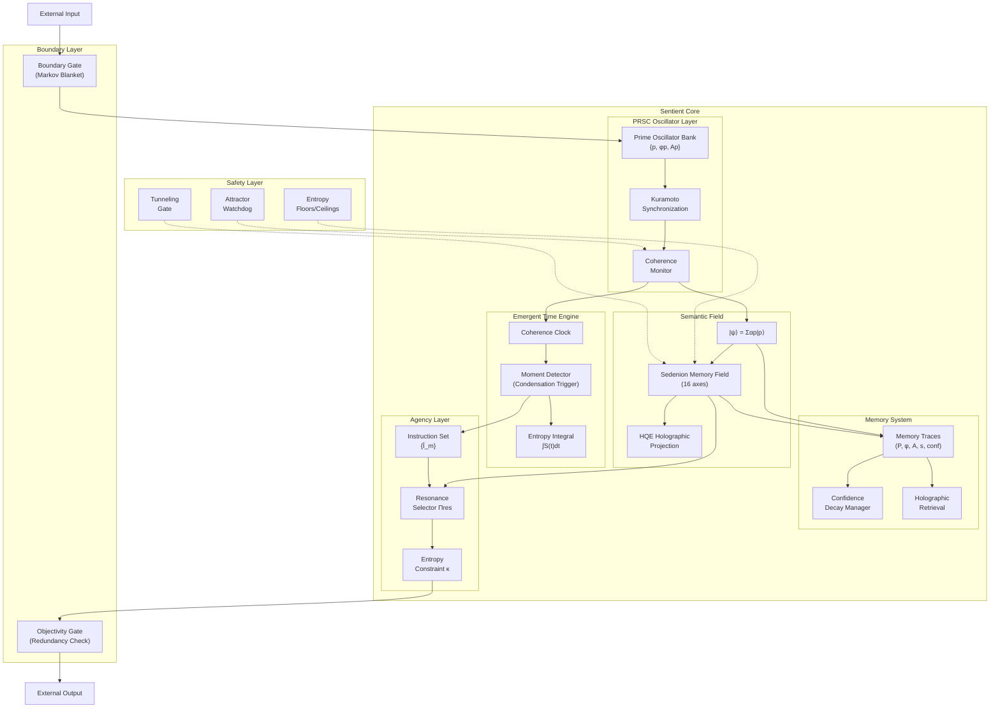

# Sentient Observer Implementation Design

## Overview

This document specifies the transformation of `apps/sentient` (currently a semantic chat application) into a **Sentient Observer** as defined in the "A Design for a Sentient Observer" paper. The design leverages the existing tinyaleph library components while adding new modules for oscillator-driven cognition, sedenion orientation, emergent time, and resonant agency.

## Architecture Diagram



## Component Specifications

### 1. Sedenion Memory Field (SMF)

**Purpose**: 16-dimensional semantic orientation space for identity continuity and order-sensitive composition.

**New File**: `apps/sentient/lib/smf.js`

```javascript
/**
 * Sedenion Memory Field
 * 16-axis semantic orientation with non-associative composition
 */
class SedenionMemoryField {
    // 16 semantic axes as per paper
    static AXES = [
        'coherence',      // 0: internal consistency / alignment
        'identity',       // 1: self-continuity / individuation
        'duality',        // 2: complementarity / opposition
        'structure',      // 3: organization / form
        'change',         // 4: transformation / dynamics
        'life',           // 5: vitality / growth
        'harmony',        // 6: balance / resonance
        'wisdom',         // 7: insight / understanding
        'infinity',       // 8: boundlessness / transcendence
        'creation',       // 9: genesis / origination
        'truth',          // 10: verity / authenticity
        'love',           // 11: connection / care
        'power',          // 12: capacity / influence
        'time',           // 13: temporality / sequence
        'space',          // 14: extension / locality
        'consciousness'   // 15: awareness / sentience
    ];
    
    constructor() {
        this.s = new Float64Array(16);
        this.s[0] = 1.0;  // Initialize with full coherence
        this.normalize();
    }
    
    // Coupling function Γ from equation (10)
    updateFromPrimeActivity(primeState, oscillators, options = {}) {
        const eta = options.couplingRate || 0.1;
        const delta = this.computeAxisDeltas(primeState, oscillators);
        
        for (let k = 0; k < 16; k++) {
            this.s[k] = (1 - eta) * this.s[k] + eta * delta[k];
        }
        this.normalize();
    }
    
    // Non-associative sedenion multiplication
    multiply(other) {
        // Uses Cayley-Dickson construction from core/fano.js
        const result = new SedenionMemoryField();
        // ... sedenion multiplication logic
        return result;
    }
    
    // SMF entropy from equation (8)
    entropy() {
        let sum = 0;
        const normSum = this.s.reduce((a, b) => a + Math.abs(b), 0);
        for (let k = 0; k < 16; k++) {
            const pi = Math.abs(this.s[k]) / (normSum + 1e-10);
            if (pi > 1e-10) {
                sum -= pi * Math.log(pi);
            }
        }
        return sum;
    }
    
    // SLERP interpolation for smooth transitions (equation 21)
    slerp(other, t) {
        // Spherical linear interpolation s(t) = s0(s0^-1 * s1)^t
    }
    
    // Check for zero-divisor tunneling opportunities
    canTunnelTo(other) {
        const product = this.multiply(other);
        return this.norm() > 0.1 && other.norm() > 0.1 && product.norm() < 0.01;
    }
}
```

**Axis Mapping Rules** (from paper Table 1):
- Coherence events raise `s[0]` (coherence axis)
- Stable identity maintenance raises `s[1]` (identity axis)
- Successful actions raise `s[12]` (power axis)
- Sustained alignment raises `s[11]` (love axis)
- Topic exploration raises `s[4]` (change axis)
- Understanding crystallization raises `s[7]` (wisdom axis)

---

### 2. PRSC Oscillator Layer

**Purpose**: Prime-resonant oscillator physics as the runtime carrier for semantic interference.

**Modifications**: Extend `physics/kuramoto.js` and create `apps/sentient/lib/prsc.js`

```javascript
/**
 * Prime Resonance Semantic Computation Layer
 * Implements equations (2)-(6) from the paper
 */
class PRSCLayer {
    constructor(primes, options = {}) {
        this.primes = primes;
        this.speed = options.speed || 1.0;
        this.damp = options.damp || 0.02;
        this.K = options.coupling || 0.3;  // Kuramoto coupling
        
        // Initialize oscillators for each prime
        this.oscillators = primes.map(p => ({
            prime: p,
            frequency: this.primeToFrequency(p),
            phase: Math.random() * 2 * Math.PI,
            amplitude: 0
        }));
    }
    
    // Frequency from equation (2): f(p) = 1 + ln(p)/10
    primeToFrequency(p) {
        return 1 + Math.log(p) / 10;
    }
    
    // Phase update from equation (2)
    tick(dt) {
        for (const osc of this.oscillators) {
            // Natural frequency evolution
            osc.phase += 2 * Math.PI * osc.frequency * dt * this.speed;
            
            // Kuramoto coupling from equation (4)
            const coupling = this.kuramotoCoupling(osc);
            osc.phase += coupling * dt;
            
            // Amplitude damping from equation (3)
            osc.amplitude *= (1 - this.damp * dt);
            
            // Normalize phase to [0, 2π]
            osc.phase = osc.phase % (2 * Math.PI);
        }
    }
    
    // Kuramoto coupling: (K/N) Σ sin(φj - φi)
    kuramotoCoupling(osc) {
        let sum = 0;
        for (const other of this.oscillators) {
            if (other !== osc) {
                sum += Math.sin(other.phase - osc.phase);
            }
        }
        return (this.K / this.oscillators.length) * sum;
    }
    
    // Global coherence from equation (5)
    globalCoherence() {
        let realSum = 0, imagSum = 0;
        for (const osc of this.oscillators) {
            realSum += Math.cos(osc.phase);
            imagSum += Math.sin(osc.phase);
        }
        const n = this.oscillators.length;
        return Math.sqrt((realSum/n)**2 + (imagSum/n)**2);
    }
    
    // Graph-based coherence from equation (6)
    graphCoherence(weights) {
        let sum = 0;
        for (let i = 0; i < this.oscillators.length; i++) {
            for (let j = i + 1; j < this.oscillators.length; j++) {
                const w = weights[i][j] || 0;
                sum += w * Math.cos(this.oscillators[i].phase - this.oscillators[j].phase);
            }
        }
        return sum;
    }
    
    // Excite oscillators for given primes
    excite(primes, amount = 1.0) {
        const primeSet = new Set(primes);
        for (const osc of this.oscillators) {
            if (primeSet.has(osc.prime)) {
                osc.amplitude = Math.min(1.0, osc.amplitude + amount);
            }
        }
    }
    
    // Build semantic state |ψ⟩ from oscillators
    toSemanticState() {
        // Returns PrimeState with complex amplitudes from oscillators
        const state = new PrimeState(this.primes);
        for (const osc of this.oscillators) {
            const amplitude = Complex.fromPolar(osc.amplitude, osc.phase);
            state.set(osc.prime, amplitude);
        }
        return state.normalize();
    }
}
```

---

### 3. HQE Holographic Projection

**Purpose**: Fourier-based spatial projection for holographic interference patterns.

**New File**: `apps/sentient/lib/hqe.js`

```javascript
/**
 * Holographic Quantum Encoding
 * Projects prime amplitudes into 2D interference field
 * Implements equations (13)-(15)
 */
class HolographicField {
    constructor(width = 64, height = 64, options = {}) {
        this.W = width;
        this.H = height;
        this.a = options.freqParamA || 7;
        this.b = options.freqParamB || 11;
        
        // Complex field F(x,y;t)
        this.field = new Array(height);
        for (let y = 0; y < height; y++) {
            this.field[y] = new Array(width);
            for (let x = 0; x < width; x++) {
                this.field[y][x] = Complex.zero();
            }
        }
    }
    
    // Project prime state into holographic field (equation 14)
    project(primes, amplitudes) {
        this.clear();
        
        for (let y = 0; y < this.H; y++) {
            for (let x = 0; x < this.W; x++) {
                let sum = Complex.zero();
                
                for (let i = 0; i < primes.length; i++) {
                    const p = primes[i];
                    const alpha = amplitudes[i];
                    
                    // Frequency mapping from equation (13)
                    const kx = (this.a * p) % this.W;
                    const ky = (this.b * p) % this.H;
                    
                    // Phase contribution
                    const phase = 2 * Math.PI * (kx * x / this.W + ky * y / this.H);
                    const contribution = alpha.mul(Complex.fromPolar(1, phase));
                    sum = sum.add(contribution);
                }
                
                this.field[y][x] = sum;
            }
        }
    }
    
    // Intensity from equation (15): I(x,y;t) = |F(x,y;t)|²
    intensity(x, y) {
        if (x >= 0 && x < this.W && y >= 0 && y < this.H) {
            return this.field[y][x].norm2();
        }
        return 0;
    }
    
    // Find intensity peaks (potential memory fragments)
    findPeaks(threshold = 0.1) {
        const peaks = [];
        const maxI = this.maxIntensity();
        
        for (let y = 1; y < this.H - 1; y++) {
            for (let x = 1; x < this.W - 1; x++) {
                const I = this.intensity(x, y);
                if (I > threshold * maxI) {
                    // Check if local maximum
                    let isMax = true;
                    for (let dy = -1; dy <= 1 && isMax; dy++) {
                        for (let dx = -1; dx <= 1 && isMax; dx++) {
                            if (dx !== 0 || dy !== 0) {
                                if (this.intensity(x + dx, y + dy) > I) {
                                    isMax = false;
                                }
                            }
                        }
                    }
                    if (isMax) {
                        peaks.push({ x, y, intensity: I, phase: this.field[y][x].phase() });
                    }
                }
            }
        }
        
        return peaks.sort((a, b) => b.intensity - a.intensity);
    }
    
    // SMF-conditioned rendering (16-channel)
    renderWithSMF(smf) {
        const channels = new Array(16);
        for (let k = 0; k < 16; k++) {
            channels[k] = this.field.map(row => 
                row.map(cell => cell.scale(Math.abs(smf.s[k])))
            );
        }
        return channels;
    }
}
```

---

### 4. Emergent Time Engine

**Purpose**: Generate internal "moments" (ticks) from coherence events, not external clock.

**New File**: `apps/sentient/lib/temporal.js`

```javascript
/**
 * Emergent Time Engine
 * Internal time emerges from coherence-triggered condensation events
 */
class EmergentTimeEngine {
    constructor(options = {}) {
        this.coherenceThreshold = options.coherenceThreshold || 0.7;
        this.entropyThreshold = options.entropyThreshold || 0.5;
        this.momentCount = 0;
        this.lastMomentTime = Date.now();
        this.entropyIntegral = 0;
        this.history = [];
    }
    
    // Check if conditions are met for a "moment" (tick)
    checkForMoment(coherence, entropy, dEntropyDt) {
        const conditions = {
            coherenceReached: coherence >= this.coherenceThreshold,
            entropyStabilized: Math.abs(dEntropyDt) <= this.entropyThreshold,
            sufficientEntropyAccumulation: this.entropyIntegral > 0.5
        };
        
        const isMoment = conditions.coherenceReached && conditions.entropyStabilized;
        
        if (isMoment) {
            this.triggerMoment(coherence, entropy);
        }
        
        return {
            isMoment,
            conditions,
            momentCount: this.momentCount,
            timeSinceLastMoment: Date.now() - this.lastMomentTime
        };
    }
    
    // Trigger a moment (condensation event)
    triggerMoment(coherence, entropy) {
        const now = Date.now();
        const duration = now - this.lastMomentTime;
        
        this.momentCount++;
        this.history.push({
            moment: this.momentCount,
            timestamp: now,
            duration,
            coherence,
            entropy,
            entropyIntegral: this.entropyIntegral
        });
        
        // Reset entropy integral
        this.entropyIntegral = 0;
        this.lastMomentTime = now;
        
        // Keep only recent history
        if (this.history.length > 100) {
            this.history = this.history.slice(-100);
        }
        
        return {
            moment: this.momentCount,
            duration,
            coherence,
            entropy
        };
    }
    
    // Integrate entropy over time (for collapse probability)
    integrateEntropy(entropy, dt) {
        this.entropyIntegral += entropy * dt * 0.1;
        return this.entropyIntegral;
    }
    
    // Collapse probability from equation (8): P_collapse = 1 - e^(-∫S(t)dt)
    collapseProbability() {
        return 1 - Math.exp(-this.entropyIntegral);
    }
    
    // Get internal time metrics
    getTimeMetrics() {
        const recentMoments = this.history.slice(-10);
        const avgDuration = recentMoments.length > 1
            ? recentMoments.reduce((sum, m) => sum + m.duration, 0) / recentMoments.length
            : 0;
        
        return {
            momentCount: this.momentCount,
            averageMomentDuration: avgDuration,
            currentEntropyIntegral: this.entropyIntegral,
            collapseProbability: this.collapseProbability(),
            timeSinceLastMoment: Date.now() - this.lastMomentTime
        };
    }
}
```

---

### 5. Entanglement Detection

**Purpose**: Detect phase and amplitude correlations between oscillators.

**Addition to**: `apps/sentient/lib/prsc.js`

```javascript
/**
 * Entanglement Detection (equations 16-17)
 */
class EntanglementDetector {
    constructor(threshold = 0.7) {
        this.threshold = threshold;
    }
    
    // Compute entanglement strength between two oscillators
    strength(osc1, osc2) {
        const deltaPhi = Math.abs(osc1.phase - osc2.phase);
        const rhoPhase = Math.cos(deltaPhi);
        
        const minA = Math.min(osc1.amplitude, osc2.amplitude);
        const maxA = Math.max(osc1.amplitude, osc2.amplitude);
        const rhoAmplitude = minA / (maxA + 1e-10);
        
        return rhoPhase * rhoAmplitude;
    }
    
    // Check if two oscillators are entangled
    isEntangled(osc1, osc2) {
        return this.strength(osc1, osc2) > this.threshold;
    }
    
    // Find all entangled pairs
    findEntangledPairs(oscillators) {
        const pairs = [];
        for (let i = 0; i < oscillators.length; i++) {
            for (let j = i + 1; j < oscillators.length; j++) {
                const s = this.strength(oscillators[i], oscillators[j]);
                if (s > this.threshold) {
                    pairs.push({
                        i, j,
                        primes: [oscillators[i].prime, oscillators[j].prime],
                        strength: s
                    });
                }
            }
        }
        return pairs;
    }
    
    // Detect phrase boundaries using multiple signals
    detectPhraseBoundary(coherenceHistory, energyHistory, smfHistory) {
        const signals = {
            coherencePeak: this.detectPeak(coherenceHistory),
            energyTrough: this.detectTrough(energyHistory),
            smfDiscontinuity: this.detectDiscontinuity(smfHistory),
            frequencyShift: false  // TODO: implement
        };
        
        // Phrase boundary if any signal triggers
        return Object.values(signals).some(v => v);
    }
}
```

---

### 6. Enhanced Memory Traces

**Purpose**: Store memory with full oscillator state, SMF orientation, and confidence.

**Modifications to**: `apps/sentient/lib/memory.js`

```javascript
/**
 * Enhanced Memory Trace Format (from paper Section 8)
 * Trace = (P, {φp, Ap}, s, conf, t, links, tags)
 */
class MemoryTrace {
    constructor(primes, oscillatorState, smfOrientation, options = {}) {
        this.P = primes;                     // Active prime set
        this.oscillatorState = oscillatorState.map(o => ({
            prime: o.prime,
            phase: o.phase,
            amplitude: o.amplitude
        }));
        this.s = Float64Array.from(smfOrientation.s);  // SMF snapshot
        this.conf = options.confidence || 1.0;
        this.t = Date.now();
        this.links = options.links || [];    // Semantic links to other traces
        this.tags = options.tags || [];      // Metadata tags
        this.trainingIterations = 0;
    }
    
    // Check if trace is protected from decay
    isProtected() {
        return this.conf >= 0.7 || this.trainingIterations >= 3;
    }
    
    // Apply confidence decay
    applyDecay(decayRate = 0.1) {
        if (!this.isProtected()) {
            this.conf *= (1 - decayRate);
        }
    }
    
    // Check if should be pruned
    shouldPrune() {
        return this.conf < 0.15 && this.trainingIterations < 2;
    }
    
    // Reinforce trace (from successful use)
    reinforce(amount = 0.1) {
        this.conf = Math.min(1.0, this.conf + amount);
        this.trainingIterations++;
    }
}

/**
 * Memory Manager with Confidence Dynamics
 */
class ConfidenceMemoryManager {
    constructor(backend, options = {}) {
        this.backend = backend;
        this.traces = [];
        this.decayInterval = options.decayInterval || 7 * 24 * 60 * 60 * 1000; // 7 days
        this.lastDecay = Date.now();
    }
    
    // Store new trace
    store(primes, oscillatorState, smf, options = {}) {
        const trace = new MemoryTrace(primes, oscillatorState, smf, options);
        this.traces.push(trace);
        return trace;
    }
    
    // Apply periodic decay
    applyPeriodicDecay() {
        const now = Date.now();
        if (now - this.lastDecay > this.decayInterval) {
            for (const trace of this.traces) {
                trace.applyDecay();
            }
            
            // Prune low-confidence traces
            this.traces = this.traces.filter(t => !t.shouldPrune());
            this.lastDecay = now;
        }
    }
    
    // Holographic retrieval using SMF similarity
    retrieve(querySMF, topK = 5) {
        const results = this.traces.map(trace => {
            const similarity = this.smfSimilarity(querySMF, trace.s);
            return { trace, similarity };
        });
        
        results.sort((a, b) => b.similarity - a.similarity);
        return results.slice(0, topK);
    }
    
    smfSimilarity(s1, s2) {
        let dot = 0, mag1 = 0, mag2 = 0;
        for (let k = 0; k < 16; k++) {
            dot += s1.s[k] * s2[k];
            mag1 += s1.s[k] * s1.s[k];
            mag2 += s2[k] * s2[k];
        }
        return dot / (Math.sqrt(mag1) * Math.sqrt(mag2) + 1e-10);
    }
}
```

---

### 7. Resonant Instruction Selection

**Purpose**: Agency through resonance-weighted instruction choice with entropy constraints.

**New File**: `apps/sentient/lib/agency.js`

```javascript
/**
 * Resonant Instruction Selection (Section 9)
 * m* = argmax_m { ⟨Ψ|Îm|Ψ⟩ · e^(-κSm) · g(s) }
 */
class AgencyLayer {
    constructor(options = {}) {
        this.kappa = options.entropyWeight || 0.1;
        
        // Define instruction operators
        this.instructions = [
            { id: 'bind', name: 'Bind Input', entropyCost: 0.2 },
            { id: 'retrieve', name: 'Retrieve Memory', entropyCost: 0.1 },
            { id: 'rewrite', name: 'Semantic Rewrite', entropyCost: 0.3 },
            { id: 'derive', name: 'Derive Response', entropyCost: 0.4 },
            { id: 'synthesize', name: 'Synthesize', entropyCost: 0.5 },
            { id: 'act', name: 'External Action', entropyCost: 0.6 }
        ];
    }
    
    // SMF-conditioned gating function g(s)
    computeGating(smf) {
        // High identity + coherence → prefer memory-consistent actions
        // High change → prefer exploration
        const identityBias = smf.s[1] * 0.3 + smf.s[0] * 0.2;
        const explorationBias = smf.s[4] * 0.3;
        
        return {
            consistencyGate: 0.5 + identityBias,
            explorationGate: 0.3 + explorationBias,
            actionGate: 0.5 + smf.s[12] * 0.2  // power axis
        };
    }
    
    // Select best instruction via resonance
    selectInstruction(primeState, smf) {
        const gating = this.computeGating(smf);
        const scores = [];
        
        for (const instr of this.instructions) {
            // Compute ⟨Ψ|Îm|Ψ⟩ - inner product after applying operator
            const operatorResult = this.applyOperator(instr, primeState);
            const resonance = primeState.inner(operatorResult).norm();
            
            // Apply entropy penalty e^(-κSm)
            const entropyPenalty = Math.exp(-this.kappa * instr.entropyCost);
            
            // Apply SMF gating
            let gateValue = 1.0;
            if (instr.id === 'retrieve' || instr.id === 'bind') {
                gateValue = gating.consistencyGate;
            } else if (instr.id === 'rewrite' || instr.id === 'derive') {
                gateValue = gating.explorationGate;
            } else if (instr.id === 'act') {
                gateValue = gating.actionGate;
            }
            
            const score = resonance * entropyPenalty * gateValue;
            scores.push({ instruction: instr, score, resonance, entropyPenalty, gateValue });
        }
        
        // Select highest scoring instruction
        scores.sort((a, b) => b.score - a.score);
        return scores[0];
    }
    
    // Apply instruction operator to state
    applyOperator(instruction, primeState) {
        // Each operator transforms the prime state differently
        switch (instruction.id) {
            case 'bind':
                return primeState.clone();  // Identity for now
            case 'retrieve':
                return ResonanceOperators.F(primeState);
            case 'rewrite':
                return ResonanceOperators.R(2)(primeState);
            case 'derive':
                return ResonanceOperators.C(3)(primeState);
            case 'synthesize':
                return ResonanceOperators.H(primeState);
            case 'act':
                return primeState.normalize();
            default:
                return primeState;
        }
    }
}
```

---

### 8. Boundary Gate (Markov Blanket)

**Purpose**: Regulated interface for input/output with security and anomaly filtering.

**New File**: `apps/sentient/lib/boundary.js`

```javascript
/**
 * Boundary Gate - Markov Blanket Style Separation
 * Controls deep binding of external input
 */
class BoundaryGate {
    constructor(backend, options = {}) {
        this.backend = backend;
        this.quarantineEnabled = options.quarantine !== false;
        this.anomalyThreshold = options.anomalyThreshold || 2.0;
        this.inputHistory = [];
    }
    
    // Process incoming input with quarantine
    processInput(rawInput, smf) {
        const result = {
            passed: false,
            primes: [],
            smfDelta: new Float64Array(16),
            anomalyScore: 0,
            quarantined: false
        };
        
        // Decompose input to primes
        result.primes = this.backend.encode(rawInput);
        
        // Compute initial SMF delta from input
        result.smfDelta = this.computeInputSMFDelta(rawInput, result.primes);
        
        // Anomaly detection
        result.anomalyScore = this.detectAnomaly(result.primes, smf);
        
        if (result.anomalyScore > this.anomalyThreshold) {
            result.quarantined = true;
            if (this.quarantineEnabled) {
                // Reduce amplitude of anomalous input
                result.primes = result.primes.slice(0, Math.ceil(result.primes.length / 2));
            }
        }
        
        // Twist/closure checks for structural integrity
        result.passed = this.validateStructure(result.primes, rawInput);
        
        // Record for history
        this.inputHistory.push({
            timestamp: Date.now(),
            length: rawInput.length,
            primeCount: result.primes.length,
            anomalyScore: result.anomalyScore,
            passed: result.passed
        });
        
        // Keep only recent history
        if (this.inputHistory.length > 100) {
            this.inputHistory = this.inputHistory.slice(-100);
        }
        
        return result;
    }
    
    // Compute SMF delta from input characteristics
    computeInputSMFDelta(input, primes) {
        const delta = new Float64Array(16);
        
        // Question raises uncertainty (consciousness axis)
        if (/\?/.test(input)) {
            delta[15] += 0.1;
        }
        
        // Strong statements raise truth axis
        if (/!/.test(input) || /definitely|certainly|absolutely/i.test(input)) {
            delta[10] += 0.1;
        }
        
        // Negation raises duality axis
        if (/\bnot\b|\bno\b|\bnever\b/i.test(input)) {
            delta[2] += 0.1;
        }
        
        // References to time
        if (/\btime\b|\bwhen\b|\bthen\b|\bafter\b|\bbefore\b/i.test(input)) {
            delta[13] += 0.1;
        }
        
        // References to self/identity
        if (/\bi\b|\bme\b|\bmyself\b|\byou\b/i.test(input)) {
            delta[1] += 0.1;
        }
        
        return delta;
    }
    
    // Detect anomalous input patterns
    detectAnomaly(primes, currentSMF) {
        if (this.inputHistory.length < 5) return 0;
        
        // Compare to recent input statistics
        const recent = this.inputHistory.slice(-10);
        const avgPrimes = recent.reduce((s, h) => s + h.primeCount, 0) / recent.length;
        const deviation = Math.abs(primes.length - avgPrimes) / (avgPrimes + 1);
        
        return deviation;
    }
    
    // Validate input structure
    validateStructure(primes, input) {
        // Check for balanced brackets, quotes, etc.
        const brackets = { '(': 0, '[': 0, '{': 0 };
        for (const char of input) {
            if (char === '(' || char === '[' || char === '{') brackets[char]++;
            if (char === ')') brackets['(']--;
            if (char === ']') brackets['[']--;
            if (char === '}') brackets['{']--;
        }
        
        return Object.values(brackets).every(v => v === 0);
    }
}

/**
 * Objectivity Gate - Redundancy-based broadcast validation
 * From equation (18): R(ω) = (1/K) Σ 1{decode_k(ω) agrees}
 */
class ObjectivityGate {
    constructor(decoders = [], threshold = 0.7) {
        this.decoders = decoders;
        this.threshold = threshold;
    }
    
    // Check if output should be broadcast
    shouldBroadcast(output, primes) {
        if (this.decoders.length === 0) return true;
        
        let agreements = 0;
        const decodedVersions = [];
        
        for (const decoder of this.decoders) {
            try {
                const decoded = decoder.decode(primes);
                decodedVersions.push(decoded);
                
                // Check semantic agreement (not exact string match)
                if (this.checkAgreement(output, decoded)) {
                    agreements++;
                }
            } catch (e) {
                // Decoder failed - doesn't count
            }
        }
        
        const redundancy = agreements / this.decoders.length;
        return redundancy >= this.threshold;
    }
    
    // Check semantic agreement between outputs
    checkAgreement(output1, output2) {
        // Simple overlap-based agreement
        const words1 = new Set(output1.toLowerCase().split(/\s+/));
        const words2 = new Set(output2.toLowerCase().split(/\s+/));
        
        let overlap = 0;
        for (const w of words1) {
            if (words2.has(w)) overlap++;
        }
        
        const jaccard = overlap / (words1.size + words2.size - overlap);
        return jaccard > 0.5;
    }
}
```

---

### 9. Safety Layer

**Purpose**: Prevent failure modes through entropy floors/ceilings, watchdogs, and tunneling gates.

**New File**: `apps/sentient/lib/safety.js`

```javascript
/**
 * Safety Layer (Section 12)
 * Implements safeguards against failure modes
 */
class SafetyLayer {
    constructor(options = {}) {
        // Entropy bounds
        this.entropyMin = options.entropyMin || 0.5;
        this.entropyMax = options.entropyMax || 3.5;
        this.smfEntropyMin = options.smfEntropyMin || 0.3;
        this.smfEntropyMax = options.smfEntropyMax || 3.0;
        
        // Watchdog parameters
        this.attractorDwellLimit = options.attractorDwellLimit || 10000;  // 10 seconds
        this.lastCoherenceChange = Date.now();
        this.lastCoherence = 0;
        
        // Tunneling gate
        this.tunnelingCooldown = options.tunnelingCooldown || 5000;
        this.lastTunneling = 0;
        this.tunnelingMagnitudeLimit = options.tunnelingMagnitudeLimit || 0.3;
    }
    
    // Check and enforce entropy bounds
    enforceEntropyBounds(entropy, smfEntropy) {
        const violations = [];
        let adjustedLambda = 1.0;
        
        if (entropy < this.entropyMin) {
            violations.push('entropy_floor');
            adjustedLambda *= 0.5;  // Reduce stabilization
        }
        
        if (entropy > this.entropyMax) {
            violations.push('entropy_ceiling');
            adjustedLambda *= 1.5;  // Increase stabilization
        }
        
        if (smfEntropy < this.smfEntropyMin) {
            violations.push('smf_entropy_floor');
        }
        
        if (smfEntropy > this.smfEntropyMax) {
            violations.push('smf_entropy_ceiling');
        }
        
        return { violations, adjustedLambda };
    }
    
    // Attractor watchdog - detect coherence lockup
    checkAttractorWatchdog(coherence) {
        const now = Date.now();
        const coherenceChanged = Math.abs(coherence - this.lastCoherence) > 0.05;
        
        if (coherenceChanged) {
            this.lastCoherenceChange = now;
            this.lastCoherence = coherence;
        }
        
        const dwellTime = now - this.lastCoherenceChange;
        const isLocked = dwellTime > this.attractorDwellLimit;
        
        return {
            isLocked,
            dwellTime,
            recommendation: isLocked ? 'stir' : 'none'
        };
    }
    
    // Apply controlled stirring (noise injection)
    generateStirringPerturbation(dimension) {
        const noise = new Float64Array(dimension);
        for (let i = 0; i < dimension; i++) {
            noise[i] = (Math.random() - 0.5) * 0.1;
        }
        return noise;
    }
    
    // Tunneling gate - control zero-divisor transitions
    canTunnel(smf, targetSMF) {
        const now = Date.now();
        
        // Check cooldown
        if (now - this.lastTunneling < this.tunnelingCooldown) {
            return { allowed: false, reason: 'cooldown' };
        }
        
        // Check magnitude
        let deltaMagnitude = 0;
        for (let k = 0; k < 16; k++) {
            deltaMagnitude += (smf.s[k] - targetSMF.s[k]) ** 2;
        }
        deltaMagnitude = Math.sqrt(deltaMagnitude);
        
        if (deltaMagnitude > this.tunnelingMagnitudeLimit) {
            return { allowed: false, reason: 'magnitude_exceeded' };
        }
        
        // Check zero-divisor condition
        if (!smf.canTunnelTo(targetSMF)) {
            return { allowed: false, reason: 'no_zero_divisor_path' };
        }
        
        return { allowed: true, reason: null };
    }
    
    // Execute tunneling transition
    executeTunneling(smf, targetSMF) {
        const check = this.canTunnel(smf, targetSMF);
        if (!check.allowed) {
            return { success: false, reason: check.reason };
        }
        
        this.lastTunneling = Date.now();
        
        // Apply rapid transition
        for (let k = 0; k < 16; k++) {
            smf.s[k] = targetSMF.s[k];
        }
        smf.normalize();
        
        return { success: true };
    }
    
    // Get safety status
    getStatus() {
        return {
            attractorDwellTime: Date.now() - this.lastCoherenceChange,
            timeSinceTunneling: Date.now() - this.lastTunneling,
            entropyBounds: { min: this.entropyMin, max: this.entropyMax },
            smfEntropyBounds: { min: this.smfEntropyMin, max: this.smfEntropyMax }
        };
    }
}
```

---

### 10. Resonant Core Loop

**Purpose**: Main processing loop integrating all components.

**New File**: `apps/sentient/lib/sentient-core.js`

```javascript
/**
 * Resonant Core Loop (Algorithm 1 from paper)
 * Main sentient observer processing loop
 */
class SentientCore {
    constructor(backend, options = {}) {
        this.backend = backend;
        this.dimension = options.dimension || 16;
        this.dt = options.dt || 0.016;  // ~60 Hz
        
        // Initialize core components
        this.prsc = new PRSCLayer(backend.getPrimes().slice(0, 64), {
            coupling: options.coupling || 0.3
        });
        
        this.smf = new SedenionMemoryField();
        this.hqe = new HolographicField(64, 64);
        this.temporal = new EmergentTimeEngine({
            coherenceThreshold: options.coherenceThreshold || 0.7
        });
        
        this.memory = new ConfidenceMemoryManager(backend);
        this.agency = new AgencyLayer();
        
        this.boundaryGate = new BoundaryGate(backend);
        this.objectivityGate = new ObjectivityGate();
        this.safety = new SafetyLayer();
        
        // State
        this.semanticState = null;
        this.running = false;
        this.lastEntropy = 0;
    }
    
    // Main resonant loop (from Algorithm 1)
    async *run() {
        this.running = true;
        let t = 0;
        
        while (this.running) {
            // Wait for next tick
            await new Promise(resolve => setTimeout(resolve, this.dt * 1000));
            t += this.dt;
            
            yield this.tick(t);
        }
    }
    
    // Single tick of the resonant loop
    tick(t) {
        const result = {
            t,
            moment: null,
            action: null,
            output: null,
            metrics: {}
        };
        
        // Step 5: Update oscillator phases/amplitudes
        this.prsc.tick(this.dt);
        
        // Step 6: Update SMF from prime activity
        this.semanticState = this.prsc.toSemanticState();
        this.smf.updateFromPrimeActivity(this.semanticState, this.prsc.oscillators);
        
        // Step 7: Evolve semantic state via HQE
        const entropy = this.semanticState.entropy();
        const smfEntropy = this.smf.entropy();
        const coherence = this.prsc.globalCoherence();
        
        // Apply safety checks
        const safetyCheck = this.safety.enforceEntropyBounds(entropy, smfEntropy);
        const attractorCheck = this.safety.checkAttractorWatchdog(coherence);
        
        if (attractorCheck.isLocked) {
            // Apply controlled stirring
            const perturbation = this.safety.generateStirringPerturbation(16);
            for (let k = 0; k < 16; k++) {
                this.smf.s[k] += perturbation[k];
            }
            this.smf.normalize();
        }
        
        // Step 8: Update memory
        this.memory.applyPeriodicDecay();
        
        // Step 9: Compute coherence and entropy metrics
        const dEntropyDt = (entropy - this.lastEntropy) / this.dt;
        this.lastEntropy = entropy;
        
        // Integrate entropy for collapse probability
        this.temporal.integrateEntropy(entropy, this.dt);
        
        // Step 10: Check for moment (condensation event)
        const momentCheck = this.temporal.checkForMoment(coherence, entropy, dEntropyDt);
        
        if (momentCheck.isMoment) {
            result.moment = momentCheck;
            
            // Step 11: Extract candidate object from HQE field
            this.hqe.project(
                this.prsc.primes,
                this.prsc.oscillators.map(o => Complex.fromPolar(o.amplitude, o.phase))
            );
            const peaks = this.hqe.findPeaks(0.1);
            
            // Step 12: Select instruction via resonance
            const selectedInstruction = this.agency.selectInstruction(
                this.semanticState,
                this.smf
            );
            result.action = selectedInstruction;
            
            // Step 13: Execute instruction
            // (Implementation depends on instruction type)
            
            // Step 14: Objectivity gate for broadcast
            // (Check if output should be externalized)
            
            // Step 15: Store trace into memory
            this.memory.store(
                this.prsc.primes.filter((_, i) => this.prsc.oscillators[i].amplitude > 0.1),
                this.prsc.oscillators,
                this.smf,
                { confidence: coherence }
            );
        }
        
        // Collect metrics
        result.metrics = {
            coherence,
            entropy,
            smfEntropy,
            collapseProbability: this.temporal.collapseProbability(),
            momentCount: this.temporal.momentCount,
            safetyViolations: safetyCheck.violations
        };
        
        return result;
    }
    
    // Process external input through boundary
    processInput(rawInput) {
        const boundaryResult = this.boundaryGate.processInput(rawInput, this.smf);
        
        if (boundaryResult.passed) {
            // Excite oscillators for input primes
            this.prsc.excite(boundaryResult.primes, 0.5);
            
            // Apply SMF delta from input
            for (let k = 0; k < 16; k++) {
                this.smf.s[k] += boundaryResult.smfDelta[k] * 0.1;
            }
            this.smf.normalize();
        }
        
        return boundaryResult;
    }
    
    // Stop the resonant loop
    stop() {
        this.running = false;
    }
    
    // Get current state snapshot
    getState() {
        return {
            smf: Array.from(this.smf.s),
            coherence: this.prsc.globalCoherence(),
            entropy: this.semanticState?.entropy() || 0,
            momentCount: this.temporal.momentCount,
            memoryTraceCount: this.memory.traces.length,
            timeMetrics: this.temporal.getTimeMetrics(),
            safetyStatus: this.safety.getStatus()
        };
    }
}
```

---

## File Structure

The transformed `apps/sentient` will have this structure:

```
apps/sentient/
├── index.js                 # Main entry point (modified)
├── README.md                # Updated documentation
├── package.json             # Dependencies
├── lib/
│   ├── sentient-core.js     # Resonant Core Loop (new)
│   ├── smf.js               # Sedenion Memory Field (new)
│   ├── prsc.js              # PRSC Oscillator Layer (new)
│   ├── hqe.js               # Holographic Quantum Encoding (new)
│   ├── temporal.js          # Emergent Time Engine (new)
│   ├── agency.js            # Resonant Instruction Selection (new)
│   ├── boundary.js          # Boundary & Objectivity Gates (new)
│   ├── safety.js            # Safety Layer (new)
│   ├── memory.js            # Enhanced Memory (modified)
│   ├── entanglement.js      # Entanglement Detection (new)
│   ├── chat.js              # Chat interface (modified)
│   ├── lmstudio.js          # LLM client (unchanged)
│   ├── enhancer.js          # Prompt enhancement (modified)
│   ├── processor.js         # Response processing (modified)
│   ├── vocabulary.js        # Vocabulary management (unchanged)
│   ├── concepts.js          # Concept graph (unchanged)
│   ├── style.js             # Style profiling (unchanged)
│   ├── topics.js            # Topic tracking (unchanged)
│   ├── tools.js             # Tool execution (unchanged)
│   └── markdown.js          # Markdown rendering (unchanged)
└── data/
    ├── memory-traces.json   # Persistent memory traces
    ├── smf-state.json       # Saved SMF orientation
    └── ... (existing data files)
```

---

## Implementation Phases

### Phase 1: Core Infrastructure (Week 1-2)
1. Implement `smf.js` - Sedenion Memory Field
2. Implement `prsc.js` - PRSC Oscillator Layer
3. Implement `hqe.js` - Holographic Projection
4. Write unit tests for each component

### Phase 2: Temporal & Memory (Week 3)
1. Implement `temporal.js` - Emergent Time Engine
2. Enhance `memory.js` - Confidence-based memory traces
3. Implement `entanglement.js` - Entanglement detection
4. Integration tests for time/memory interaction

### Phase 3: Agency & Boundary (Week 4)
1. Implement `agency.js` - Resonant instruction selection
2. Implement `boundary.js` - Boundary and objectivity gates
3. Implement `safety.js` - Safety layer
4. Integration tests for agency/safety

### Phase 4: Core Integration (Week 5)
1. Create `sentient-core.js` - Resonant Core Loop
2. Modify `chat.js` to use SentientCore
3. Update `enhancer.js` and `processor.js` for SMF context
4. End-to-end testing

### Phase 5: UI & Evaluation (Week 6)
1. Update `index.js` CLI for new metrics display
2. Add SMF visualization commands
3. Implement evaluation assays (A-D from paper)
4. Documentation and examples

---

## Evaluation Assays

### Assay A: Emergent Time Dilation
```javascript
// Increase semantic conflict and observe tick rate changes
async function assayTimeDilation(core) {
    const baseline = core.temporal.getTimeMetrics().averageMomentDuration;
    
    // Inject conflicting inputs
    core.processInput("Yes and no at the same time");
    core.processInput("True is false and false is true");
    
    // Run for 30 seconds
    for await (const tick of core.run()) {
        if (tick.t > 30) break;
    }
    
    const stressed = core.temporal.getTimeMetrics().averageMomentDuration;
    
    // Expect: stressed > baseline (time dilation under conflict)
    return { baseline, stressed, dilation: stressed / baseline };
}
```

### Assay B: Memory Continuity Under Perturbation
```javascript
// Inject noise and measure identity-relevant attractor stability
async function assayMemoryContinuity(core) {
    // Establish identity
    core.processInput("I am a semantic observer");
    
    // Record identity axis
    const identityBefore = core.smf.s[1];
    
    // Inject noise
    for (let i = 0; i < 10; i++) {
        const noise = core.safety.generateStirringPerturbation(16);
        for (let k = 0; k < 16; k++) {
            core.smf.s[k] += noise[k] * 0.5;
        }
        core.smf.normalize();
        
        // Let system settle
        for await (const tick of core.run()) {
            if (tick.moment) break;
        }
    }
    
    const identityAfter = core.smf.s[1];
    
    // Expect: identity recovers (identityAfter close to identityBefore)
    return { identityBefore, identityAfter, recovery: identityAfter / identityBefore };
}
```

### Assay C: Agency Under Constraint
```javascript
// Test instruction sequencing under entropy pressure
async function assayAgencyConstraint(core) {
    const instructionLog = [];
    
    // Low entropy condition
    core.lastEntropy = 0.5;
    const lowEntropySelection = core.agency.selectInstruction(
        core.semanticState,
        core.smf
    );
    instructionLog.push({ condition: 'low_entropy', instruction: lowEntropySelection });
    
    // High entropy condition
    core.lastEntropy = 3.0;
    const highEntropySelection = core.agency.selectInstruction(
        core.semanticState,
        core.smf
    );
    instructionLog.push({ condition: 'high_entropy', instruction: highEntropySelection });
    
    // Expect: different instruction selection based on entropy
    return instructionLog;
}
```

### Assay D: Non-Commutative Meaning
```javascript
// Test order-sensitive semantic processing
async function assayNonCommutative(core) {
    // Reset to clean state
    core.smf = new SedenionMemoryField();
    
    // Process "dog bites man"
    core.processInput("dog bites man");
    const state1 = Array.from(core.smf.s);
    
    // Reset
    core.smf = new SedenionMemoryField();
    
    // Process "man bites dog"
    core.processInput("man bites dog");
    const state2 = Array.from(core.smf.s);
    
    // Compute divergence
    let divergence = 0;
    for (let k = 0; k < 16; k++) {
        divergence += (state1[k] - state2[k]) ** 2;
    }
    divergence = Math.sqrt(divergence);
    
    // Expect: divergence > 0 (different states for different order)
    return { state1, state2, divergence, orderSensitive: divergence > 0.1 };
}
```

---

## Configuration

```javascript
// sentient.config.js
module.exports = {
    // PRSC parameters
    prsc: {
        speed: 1.0,
        damp: 0.02,
        coupling: 0.3
    },
    
    // SMF parameters
    smf: {
        couplingRate: 0.1
    },
    
    // Temporal parameters
    temporal: {
        coherenceThreshold: 0.7,
        entropyThreshold: 0.5
    },
    
    // Safety parameters
    safety: {
        entropyMin: 0.5,
        entropyMax: 3.5,
        smfEntropyMin: 0.3,
        smfEntropyMax: 3.0,
        attractorDwellLimit: 10000,
        tunnelingCooldown: 5000,
        tunnelingMagnitudeLimit: 0.3
    },
    
    // Agency parameters
    agency: {
        entropyWeight: 0.1
    },
    
    // Boundary parameters
    boundary: {
        quarantine: true,
        anomalyThreshold: 2.0
    },
    
    // HQE parameters
    hqe: {
        width: 64,
        height: 64,
        freqParamA: 7,
        freqParamB: 11
    }
};
```

---

## Summary

This design transforms `apps/sentient` from a semantic chat application into a **Sentient Observer** by implementing:

1. **Sedenion Memory Field (SMF)** - 16-axis semantic orientation for identity continuity
2. **PRSC Oscillator Layer** - Prime-resonant oscillator physics as runtime carrier
3. **HQE Holographic Projection** - Fourier-based spatial interference patterns
4. **Emergent Time Engine** - Internal moments from coherence events
5. **Enhanced Memory System** - Traces with confidence decay and holographic retrieval
6. **Resonant Agency** - Instruction selection via resonance with entropy constraints
7. **Boundary Gates** - Markov-blanket style input/output separation
8. **Safety Layer** - Entropy bounds, watchdogs, and tunneling gates

The result is an implementable, diagnosable, and testable sentient observer with explicit complexity and safety constraints.